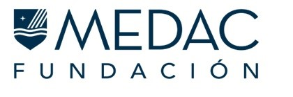

Presentamos nuestro refugio felino. 

Actualmente contamos con 13 batcatines necesitados, que iremos  presentando, y rescatados de la calle. Los hemos rehabilitado y  esterilizado, y actualmente de encuentran en adopción a familias responsables que quieran darles amor. 

Por desgracia esto implica mucha inversión económica en piensos, latitas de comida húmeda... y muchísimos gastos veterinarios.

¡Necesitamos de tu solidaridad para seguir ayudándolos! 

# Acuerdo de Colaboración

El pasado dia 4/5/23 nuestra Plataforma ha firmado un **importante acuerdo de colaboración de la Fundación MEDAC**, una organización sin ánimo de lucro que persigue un mundo más sostenible y ecológico, proteger y mejorar la vida de las personas y los animales, favorecer y ayudar a los colectivos más desfavorecidos y vulnerables y ayudar a los alumnos y empleados de Formación Profesional en riesgo de exclusión.

El objeto de este Convenio es establecer el **marco estratégico de colaboración** entre ambas entidades para la consecución de los fines fundacionales por lo que en nuestro **Refugio BATCAT** se llevará a cabo  un profundo _estudio básico de salud_ (sangre, orina, heces) a nuestros batcatines en régimen de acogida, liderados por técnicos especialistas en cada una de las ramas que se abordan Dietética, Anatomía Patológica y Laboratorio Clínico.

La Fundación MEDAC persigue generar un cambio positivo en la sociedad y por ello lleva a cabo proyectos y estudios en pro del avance sanitario, científico y social y que generen ayuda directa a colectivos vulnerables en sus 11 centros de investigación biomédica en toda España.

Estos centros de investigación, repartidos por diferentes ciudades del territorio nacional (Madrid, Málaga, Murcia, Sevilla, Valencia, Alicante, Zaragoza, Granada, Córdoba, Almería y Albacete), cuentan con la alianza de empresas referentes en cada sector, como Siemens Healthineers, Vithas o Hospital Universitario Rey Juan Carlos, entre muchas otras.   

Puedes conocerles más en la web:  https://medac.es/fundacion

