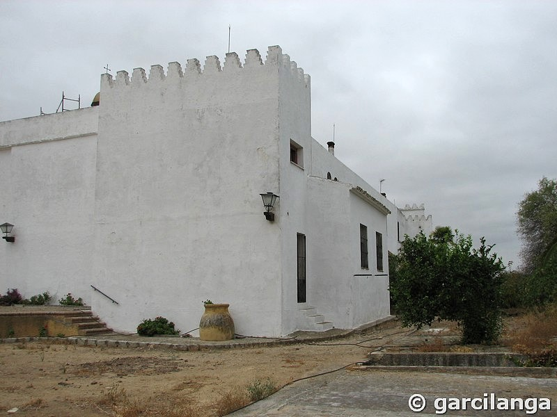
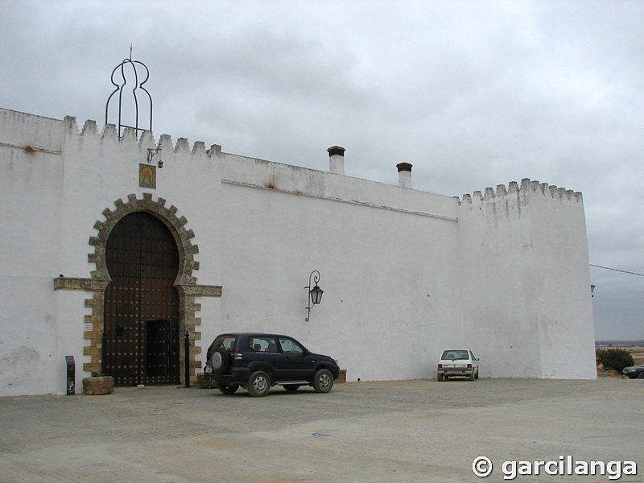
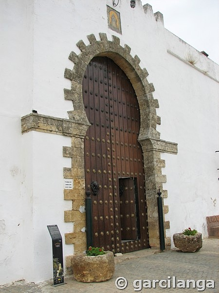
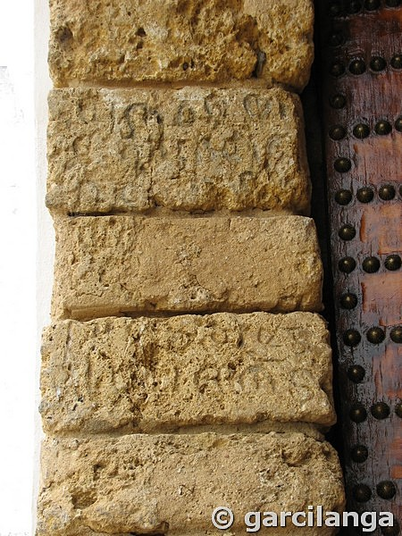
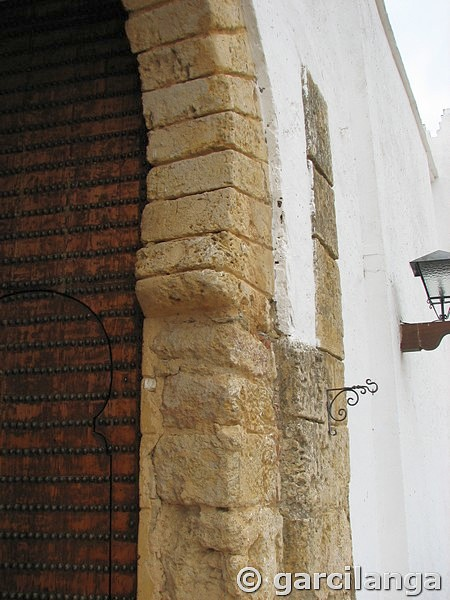
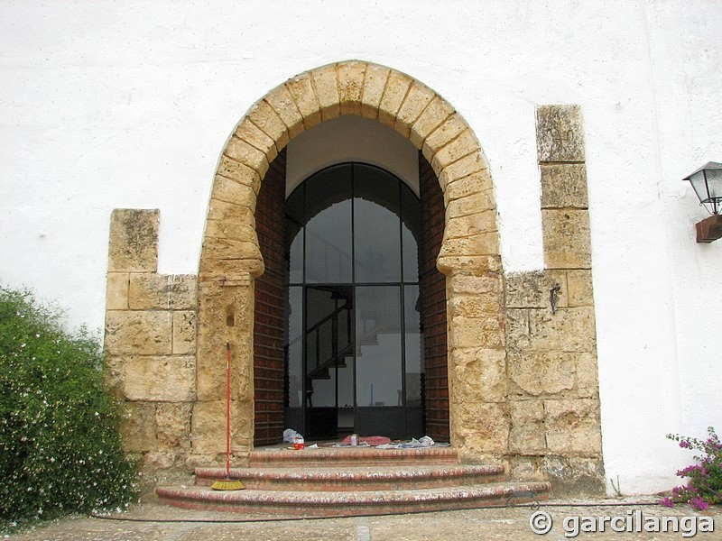
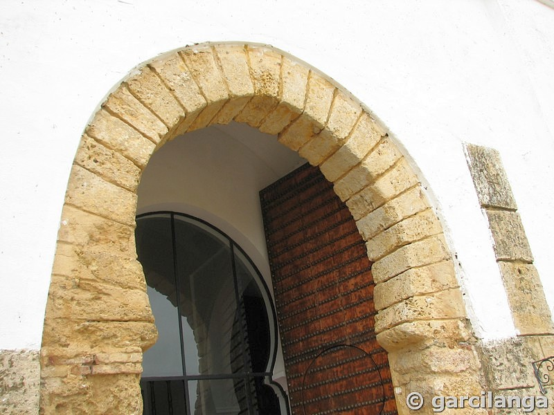
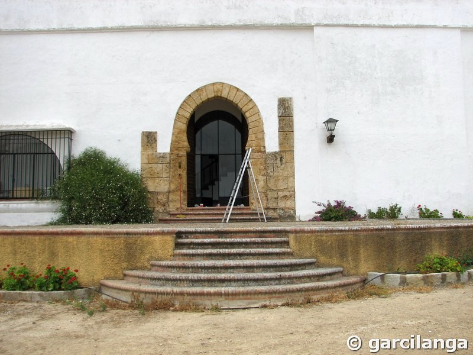
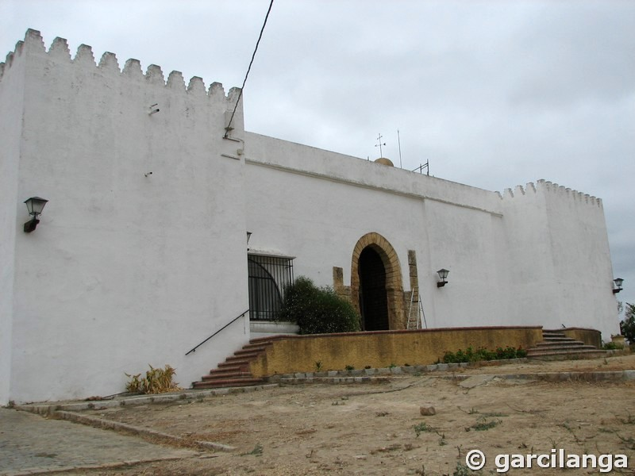
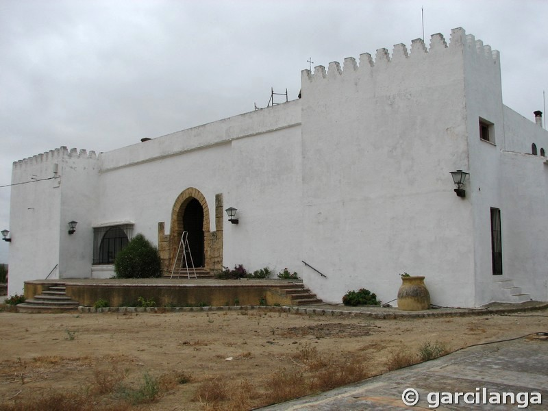

# AL-MIZAR / Alpizar / LAPIÇAR
Traducido como el río de la estrella (alp-izar), El Castillo del Alpízar es antigua fortaleza que se encuentra cerca de la aldea de Tujena (Tulius) y es visible desde todo el campo de Tejada, junto al llamado Acebuchal del Alpízar (paraje incluido en la lista de “Lugares de Interés Comunitario”), un entorno típico de nuestra campiña, rodeado de campos de cultivo de cereal, girasol y olivos.

El castillo es una edificación relativamente pequeña, de planta trapezoidal, patio central y un torreón almenado en cada esquina, a los que se accede a través del camino de ronda perimetral, a excepción del lienzo oeste, que carece de él. Cada uno de los torreones es de distinto tamaño. Las almenas, que son escalonadas, no parecen, dado su escaso tamaño, ser las originales.

Su fachada principal se orienta hacia el sur, y en ella se abre una portada almohade, probablemente la original, del siglo XI: arco de herradura apuntado, del que sobresalen, de manera alterna trece dovelas. Sobre esta puerta aún permanecen algunas almenas de igual factura a las de las torres. A través de ella se accede directamente al que fue patio de armas del castillo. En su fachada este se abre otro acceso, también en arco de herradura apuntado, pero más pequeño y tosco que el anterior. Todos sus muros exteriores son de tapial y actualmente, como no podía ser de otra manera pues es un cortijo, están encalados. En su entorno más inmediato quedan vestigios de lo que debió ser una barrera.

Tras la conquista castellana y en el repartimiento que se hizo de la comarca, fue adjudicado a D. Juan Mathe de Luna, Camarero Mayor de Sancho IV. A partir de entonces pasó por diferentes dueños, hasta que el 7 de agosto de 1.516 fue vendida al Almirante y Virrey de las Indias, D. Diego Colón, junto con la Villa de la Palma.

Hoy es un cortijo que, desde mediados del siglo XIX, ha sufrido, de nuevo, numerosas transformaciones, a fin de adaptarlo al uso residencial de sus propietarios y de ahí que su estado de conservación sea excelente. Pero no por ello, la ausencia de ostentosidad, lo hace desmerecer de su blanca presencia, su ligera altura y, sobre todo, su total fusión en un paisaje tan singular, le concede un digno encanto.

Actualmente se encuentra bajo la protección de la Declaración genérica del Decreto de 22 de abril de 1949, y la Ley 16/1985 sobre el Patrimonio Histórico Español. En el año 1993 la Junta de Andalucía otorgó reconocimiento especial a los castillos de la Comunidad Autónoma de Andalucía.

     

     

## Documentos
* [Al-pisar, Memoria del proyecto de Rehabilitación del Castillo-Cortijo de Alpízar, Huelva](https://idus.us.es/handle/11441/37507)