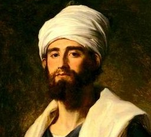
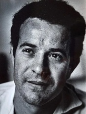

La familia Ibn Zuar fue propietaria de esta finca castellanizada como _Chichina Abenzoar_ (parece ser un mozarabismo derivado de _siccina_, en el sentido de _"secano"_), alquería- aldea junto a otra alquería cercana pero en la orilla oriental del Guadiamar, llamada Bury ibn Zuar, _"torre de los Ibn Zuar"_, conocida actualmente como Torre de Martín Cerón o de Guadiamar. 

Con la expropiación a la población andalusí tras la conquista cristiana, estas haciendas se repartieron entre miembros de la familia real y personajes más o menos encumbrados a los cuales quiso distinguir el rey. No son muy numerosos y se refieren casi siempre a pequeños núcleos de población cuando no a plazas de frontera a menudo difícilmente defendibles. Algunos de esos señoríos fueron de obispalía. Así, por ejemplo, en 1253, Alfonso X otorgaba al obispo de Segovia don Remondo, futuro arzobispo de Sevilla, la Torre de Borgabenzoar, con 20 yugadas de heredad, 15 de ellas en Chichinat Abenzoar. 


Do e otorgo a uos, don Remondo.., la torre que dizíen en tiempo de moros Boriaenzohar, a que yo pus nombre Segouiola, con so olivar e con so figueral e con sus vinnas que a de los moiones adentro, cuemo don Gongaluo García de Torquemada e Roy López de Mendoga la moionaron por mío mandado. E dóuosla con sus casas e con sus molinos e con todos sus términos e con quanto a e deue auer e con quanto pertenece a esta torre. Et douo los molinos del azeyte que son hy, libres e quitos, que non dedes dellos derecho ninguno. E douos veynte yugadas de bueyes, año e uez, de heredad pora pan, las cinquo que son derredor de la torre, en término dé la torre, e las diz e cinque (sic) en Chichinat Auenzohar. Et mando que por este heredamiento que uos yo do, que me tengades un omne guisado de cauallo e de armas de fust e de fierro mientra fuere uestro. 


Se deduce que es una simple torre (su nombre _Burg_ Avenzoar así lo indica) con un distrito pequeño porque de las 20 yugadas que le asigna, sólo cinco de ellas pertenecen al término de la torre, mientras que las 15 restantes pertenecen a la otra propiedad llamada Chichinat Auenzohar.

## Ibn Zuhr Al-Isbīlī (Avenzoar) ابن زهر 

Ibn Zuhr nació en la localidad de Peñaflor, cerca de Išbīliya (Sevilla) en 1073 (según Ibn al-Abbar’, en 1091​-1092 /484 H o 1094-1095 /487 H) y murió en Išbīliya, en 1161/1162/557 H.​

Perteneciente a la dinastía Banū Zuhr de médicos andalusíes, su educación fue la típica de la Ḫassa o clase alta islámica, basada en conocimientos religiosos, jurídicos, y literarios, a lo que se añadió su formación médica como discípulo de su padre.​

Se conoce que se casó joven y tuvo al menos dos hijos varones y una hija, que también se dedicaron a la medicina, así como una de sus nietas.​

Su familia habían sido médicos de dinastía de los Banū ‘Abbad, reyes de la Taifa de Sevilla, por lo que con la conquista por parte de los almorávides, perdieron el favor de los gobernantes y sobre 1124 fue encarcelado en Marrakech por unos diez años. En 1146 el califa almohade tomó Marrakech, liberó a Ibn Zuhr y decidió dejar la Corte para regresar a Sevilla.

Al morir fue enterrado con sus antepasados​ en la Bāb al-Fath o Puerta de la Victoria de Sevilla.​

## Necrópolis de Chichina
Las tumbas de Chichina estaban situadas en un terreno llano, en casi imperceptible elevación, dentro de una zona de tierras óptimas para la agricultura intensiva. Son tumbas de planta rectangular u oval, orientadas de E a W, construidas a base de lajas de pizarra que sobrepasan el número de cuatro y van conformando el perímetro. Todas (cuatro y una fosa con enterramiento infantil) contenían restos de la inhumación en posesión decúbito lateral y fetal ocupando la mitad anterior de la tumba. El ajuar se depositó a la altura de los brazos, en los pies o en la cabeza y estaba compuesto por un cuenco y un vaso globular, una lámina de cobre y una lasca de sílex, en algún caso.

Además, las piezas dentarias de las tumbas de Chichina muestran ausencia de caries y gran desgaste por masticación, lo que también ocurre en otras tumbas similares, evidenciando tal vez una dieta vegetariana.

Las cerámicas aparecidas en el exterior de las tumbas proceden de varios fondos de cabañas muy arrasados, localizados en las inmediaciones de las cistas. 

### Cista I
[Museo Arqueológico de Sevilla](http://ceres.mcu.es/pages/ResultSearch?txtSimpleSearch=Museo%20Arqueol%F3gico%20de%20Sevilla&simpleSearch=0&hipertextSearch=1&search=simple&MuseumsSearch=&MuseumsRolSearch=2&listaMuseos=null)

Cista rectangular (1.25 x 0.60 cm), elaborada con 9 lajas de pizarra de distinto tamaño. Orientación Este-Oeste. Inhumación individual en posición fetal, con la cabeza y la mandíbula desplazadas. 

Incluye:
* **Ajuar depositado junto a la cabeza, compuesto por cuenco y urna de forma globular, boca ancha y borde ligeramente saliente.**
  * Altura = 19 cm; Diámetro máximo = 20 cm; Diámetro boca = 13 cm; Peso = 1450 gr
  * 1300[ac][ca] (Último cuarto del II milenio a. C.) Bronce Pleno
  * Este tipo de urnas son características de los ajuares funerarios del Bronce Pleno. Su peculiar forma es similar a los ejemplares documentados en otras necrópolis de cistas del mismo periodo, como las onubenses de El Becerrero y El Castañuelo. Estas semejanzas permiten fechar la sepultura y el conjunto de cistas a mediados del segundo milenio a. C.
* **Cuenco**
  * Altura = 4,30 cm; Diámetro máximo = 13,50 cm; Diámetro boca = 11 cm; Peso = 273 gr
  * CUENCO.CASQUETE ESFÉRICO ACHATADO CON BORDE ENTRANTE.
  * 1300[ac][ca] (Último cuarto del II milenio a. C.)
  * Este pequeño cuenco presenta unas características técnicas y formales muy semejantes al resto de los cuencos recuperados en Chichina. Se depositó bajo el cuello del difunto, asociado a una vasija globular de medianas dimensiones. Se trata de un ajuar habitual en los enterramientos del Bronce Pleno, similar a los documentados en otras sepulturas del mismo periodo como El Becerrero y El Castañuelo en Huelva.

### Cista II
[Museo Arqueológico de Sevilla](http://ceres.mcu.es/pages/ResultSearch?txtSimpleSearch=Museo%20Arqueol%F3gico%20de%20Sevilla&simpleSearch=0&hipertextSearch=1&search=simple&MuseumsSearch=&MuseumsRolSearch=2&listaMuseos=null)

Cista ovalada (1.65 x 1.05 cm), elaborada con 15 lajas de pizarra de dimensiones medias. Orientación Este-Oeste. Inhumación individual en posición fetal. Ajuar compuesto por:
* **Cuenco**
  * Altura = 4 cm; Diámetro = 12 cm
  * CUENCO DE CASQUETE ESFÉRICO CON BORDE RECTO.
  * 1300[ac][ca] (Último cuarto del II milenio a. C.)
* **Urna**
  * Altura = 28 cm; Diámetro máximo = 23,50 cm; Diámetro boca = 9,50 cm; Peso = 2325 gr
  * URNA CUERPO GLOBULAR, BOCA ESTRECHA Y BORDE RECTO.
  * 1300[ac][ca] (Último cuarto del II milenio a. C.)
  * Esta urna se localizó en el extremo oriental de la cista, más allá de los pies del difunto. Su forma se equipara a la serie de vasijas utilizadas como ofrenda funeraria en los enterramientos individuales del Bronce Pleno. Su hallazgo frecuente con cuencos de pequeñas dimensiones define un tipo de ajuar equiparable a las costumbres del resto de las comunidades del Bronce Pleno en Andalucía. Los ejemplos más cercanos se localizan en las necrópolis de cistas de El Becerrero y El Castañuelo en Huelva.

### Cista III
[Museo Arqueológico de Sevilla](http://ceres.mcu.es/pages/ResultSearch?txtSimpleSearch=Museo%20Arqueol%F3gico%20de%20Sevilla&simpleSearch=0&hipertextSearch=1&search=simple&MuseumsSearch=&MuseumsRolSearch=2&listaMuseos=null)

Cista rectangular (1.35 x 0.72 cm), elaborada con 9 lajas de pizarra de distinto tamaño. Orientación Oeste-este. Inhumación individual, en posición encogida.

Incluye:
* **Punta de flecha**
  * Cobre Martilleado y Pulido
  * Longitud = 3,50 cm; Peso = 1 gr; Anchura máxima = 0,70 cm; Anchura mínima = 0,10 cm
  * PIEZA METÁLICA, FORMA ROMBOIDAL PLANA CON EXTREMOS PROLONGADOS, UNO MÁS CORTO. PROBABLE OBJETO DE ADORNO. Esta pieza de metal es la única encontrada en las sepulturas de Chichina. Su hallazgo reviste un especial interés, por su excepcionalidad y la rareza de su forma, que impide precisar su función específica. Se pensó que podría tratarse de un objeto de adorno, pero su forma se asemeja a una punta de flecha foliácea de pedúnculo largo, similar a las documentadas en otros contextos de la Edad del Bronce. Se trata de un tipo característico del Bronce Antiguo y Medio, con una distribución situada entre Cataluña hasta el Algarve, con especial intensidad en Levante, Submeseta Sur y Andalucía Oriental
  * 1300[ac][ca] (Último cuarto del II milenio a. C.)
* **Cuenco**
  * Altura = 6 cm; Diámetro máximo = 12,50 cm; Diámetro boca = 10 cm; Peso = 214 gr
  * CUENCO DE CASQUETE ESFÉRICO Y BORDE ENTRANTE
  * 1300[ac][ca] (Último cuarto del II milenio a. C.)
  * Este cuenco sobresale entre el resto de ejemplares recuperados en Chichina por su peculiar técnica y morfología. De aspecto frágil e irregular, se utilizó de forma exclusiva en el ritual funerario. La forma se asemeja con ligeras variantes a la serie de cuencos con el borde entrante de la Edad del Bronce Pleno, asociados en las necrópolis a urnas de tipo globular.
* **Urna**
  * Altura = 17,50 cm; Diámetro máximo = 20,50 cm
  * URNA, BASE MUY FRAGMENTADA.
  * 1300[ac][ca] (Último cuarto del II milenio a. C.)

### Cista IV
[Museo Arqueológico de Sevilla](http://ceres.mcu.es/pages/ResultSearch?txtSimpleSearch=Museo%20Arqueol%F3gico%20de%20Sevilla&simpleSearch=0&hipertextSearch=1&search=simple&MuseumsSearch=&MuseumsRolSearch=2&listaMuseos=null)

Cista ovalada (1.62 x 0.92 cm), elaborada con 13 lajas de pizarra de medianas dimensiones, hincadas en sentido diagonal y 3 que formaban la cubierta. Orientación Noreste-Suroeste. Inhumación individual en posición fetal, con el ajuar cerámico colocado sobre las manos. Incluye:

* **Cuenco**
  * De Barro Bruñido y Alisado
  * Altura = 6 cm; Diámetro máximo = 14 cm
  * CUENCO DE CASQUETE ESFÉRICO CON BORDE INDEFERENCIADO RESPECTO A LA PARED.
  * 1300[ac][ca] (Último cuarto del II milenio a. C.)

## El hallazgo

>  En diciembre de 1974, D. Diego Puerta, propietario del cortijo ordenó igualar una zona de terreno cerca del Arroyo Molinillo con las colindantes para rellenar una depresion por la que corría el agua. Dicha elevación no llegaba en su parte más alta a un metro de desnivel en pendiente suave formando un montículo en el que crecía la vegetación espontánea.
>
> Tras la nivelación, los arados sacaron a la superficie lajas de pizarra de la Cista I, dándose parte urgente a las autoridades que iniciaron las tareas de excavación y documentación.