Las condiciones ambientales del suroeste peninsular, favorables para la actividad agrícola y ganadera, propiciaron la proliferación de asentamientos en la Sierra de Tejada, así como de estructuras megalíticas a partir del IV milenio a.n.e.

Gracias a ello, en término de Berrocal existe un valioso patrimonio megalítico en lo que a complejos dolménicos se refiere, como el del Puerto de los Huertos, el Casullo o el de Mascotejo, posteriores al proceso de expansión y monumentalización emprendido por los primeros pobladores de la zona.

De características estructurales similares, podemos considerar estos monumentos funerarios como dólmenes de galería por poseer tres elementos bien diferenciados: el túmulo, una única galería orientada hacia el Este y el atrio, lugar donde se encontraba el altar en el que se depositaban las ofrendas funerarias.

Respecto al estado de conservación de algunos de ellos, cabe decir que su aparente deterioro responde a una destrucción intencionada durante el II milenio a.C., tal y como se ha documentado.

Entre ellos destaca el **_grupo del Hornueco_**,  que se ubica sobre un cerro que forma parte de una estribación de cerros de fuertes pendientes y topografía quebrada, delimitados por la ribera de Hornueco al norte y el arroyo de Enmedio. 

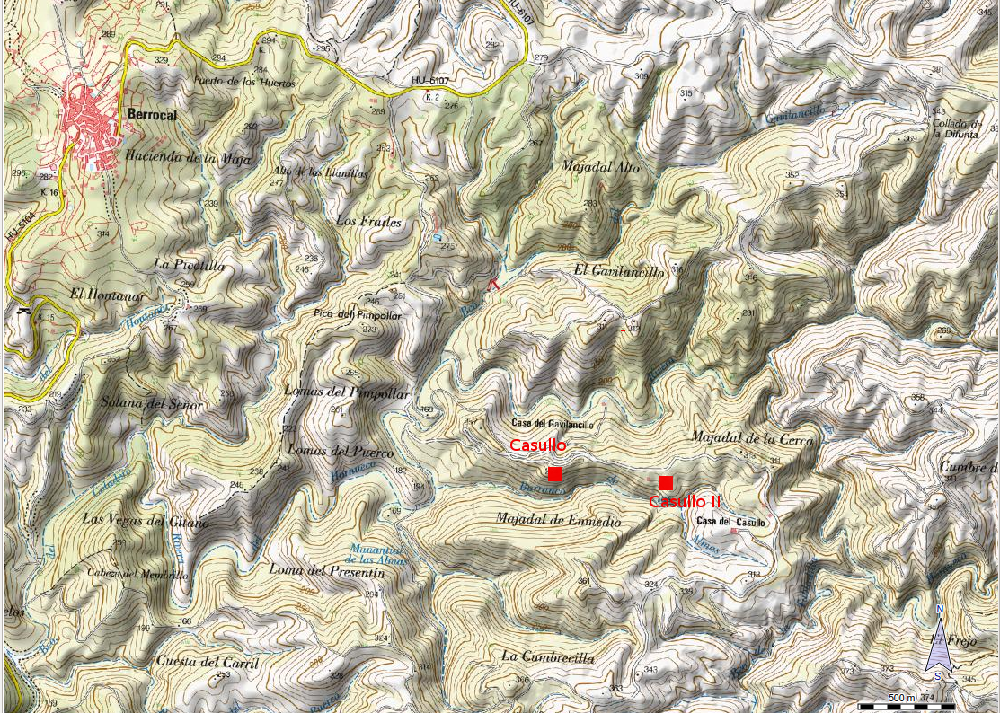

## Grupo del Hornueco
### Casullo I, Casullo II, Hornueco, Gaviloncillo, Collado de los Pinos
El principal es el **_dolmen del Casullo_**, tanto por ser el más antiguo de la provincia de Huelva (fines del IV milenio a.n.e., en la transición del Neolítico Final a la Edad del Cobre) como por el hallazgo que allí se produjo, un ídolo tolva prehistórico con atributos femeninos realizado en barro con pigmentos rojos conocido como la "_Venus del Casullo_". En elevaciones de cotas más bajas se sitúan el resto de las construcciones megalíticas (**Casullo II, Hornueco, Gaviloncillo, Collado de los Pinos**) que componen este grupo.

Este dólmen posee tres elementos estructurales diferenciados: túmulo, galería rectilínea y atrio. El túmulo es de morfología oval, alcanza 17,50 metros en el eje este, presenta de nuevo un sistema de construcción escalonado compuesto de distintos niveles constructivos: dos anillos de refuerzo que circundan la estructura megalítica, lajas perimetrales y un relleno de piedras (masa tumular), que recubre los anteriores elementos y conforman la morfología definitiva del túmulo. Su estructura interna se define como una galería con leve orientación sureste, de 9,20 metros de longitud, 0,80 metros de anchura en la entrada y 1,20 metros en la cabecera, formando un espacio en el que se distinguen distintas unidades: ortostatos anclados en profundas zanjas de cimentación 0,40-0,50 metros de profundidad excavadas en el afloramiento de pizarra, muro de mampostería de la mitad sur de la estructura y "altar" adosado, en donde se depositaron ofrendas funerarias: cazuelas de cerámica, láminas de piedra tallada, hachas pulimentadas y la "_Venus del Casullo_". También presenta en la zona central de la cabecera los restos de una _estela_ fracturada casi en la base, dispuesta en una pequeña fosa y fijada con cantos de cuarzo y lajas. El atrio es un espacio abierto compuesto por dos elementos: rampa de acceso con pavimento de cuarzo y arcilla compactada y vestíbulo delimitado por piedras que marcan la entrada a la tumba. 

Su uso debió perdurar durante todo el III milenio, produciéndose su transformación en el tránsito al II milenio, como manifiesta la ausencia y fracturación de los ortostatos que formaban la galería. Con posterioridad, este espacio funerario se reutilizó a inicios del I milenio a.n.e. (1192-998 a.n.e.), en el Bronce Final, por lo que debió perdurar el valor sagrado y simbólico de este monumento megalítico.

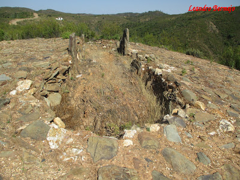 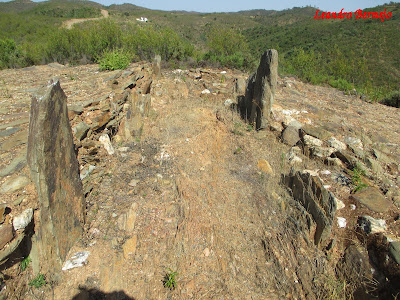 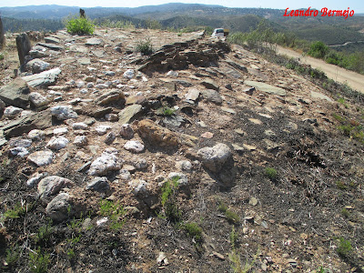 

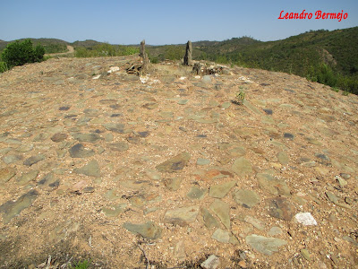 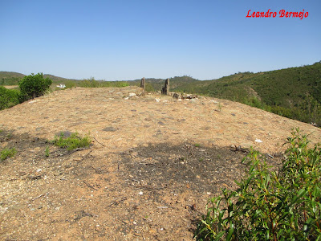 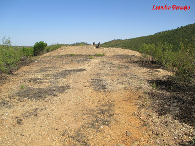 

## Dolmen del Puerto de los Huertos
### Tumba del Moro
Se ubica en altura, sobre el espolón norte de una estribación montañosa, lugar desde el que se posee una alta visibilidad hacia el este, donde se prolonga el valle de la ribera del El Gallego. Su construcción se produjo en los primero siglos del III milenio a.n.e., prolongándose su uso durante todo el milenio tal como muestran las dataciones obtenidas en el suelo interno de la cámara (2833-2487 cal. a.n.e.) y en el pavimiento del vestículo (2548-2346 cal. a.n.e.).

Presenta 3 elementos diferenciados: túmulo, galería y atrio:

El **túmulo** es de morfología oval, mide de 16,50 metros en el eje mayor, y cuenta con un sistema de construcción complejo formado por distintos elementos constructivos escalonados: dos anillos de refuerzo dispuestos perimetralmente en torno a la estructura megalítica, compuestos por lajas hincadas y rellenos internos de rocas volcánicas y lajas trabadas con arcilla; lajas perimetrales de contención y relleno de la masa tumular, definido por un conglomerado de arcilla y piedras, que recubren los anteriores niveles. La función de estos elementos constructivos es reforzar la galería, contener la masa tumular y culminar la morfología del túmulo. 

La estructura megalítica interna se define como una galería rectilínea de espacio único, orientada 90° este, que cuenta con unas dimensiones de 7,50 metros en el eje longitudinal este-oeste, 0,60 metros de anchura en el acceso (enmarcado por dos ambas que definen la entrada), 1,40 metros en el tramo intermedio y 1,20 metros en la cabecera de morfología semicircular. En la zona central de la cabecera se presenta la base de una "estela" de morfología rectangular, anclada en el sustrato de pizarra, conservándose en altura 30 centímetros y máxima anchura de 15 centímetros.

El suelo se define como un pavimento apisonado de arcilla echado sobre el afloramiento. El atrio forma un espacio abierto y abocinado hacia el interior, compuesto por 3 sectores diferenciados: rampa de acceso con pavimento de pequeñas lajas de piedra y arcilla, altar escalonado de bolos de roca volcánica en el lateral norte, y vestíbulo con pavimento de piedras y arcilla apisonada, en donde se depositaron objetos tales como recipientes cerámicos (platos de borde engrosado, cuencos, vasos, ollas y cazuelas), productos líticos tallados (puntas de flecha, láminas-cuchillos, microlitos geométricos), hachas y azuelas pulimentadas, cuentas de collar de piedras verdes, ídolos cruciformes de pizarra y prismas de cristal de roca (cuarzo). 

En la transición del III y II milenios a.n.e., ser produjo la destrucción del monumento megalítico, tal como apunta la datación obtenida de la zanja de condenación del área de la cabecera (2137-1979 cal. a.n.e.). Esta acción de destrucción deliberada explicaría el bajo estado de conservación del dolmen, estando ausente la gran mayoría de los ortostatos y la alta fragmentación de los que se preservan anclados en la zanja de cimentación, fracturados la mayoría a cota de suelo de la tumba.

Este episodio de destrucción hay que ponerlo en relación con las transformaciones políticas que acontecen en la transición de la Edad del Cobre a la Edad del Bronce Antiguo, cuando en el área de Sierra Morena se consolidan comunidades con una nueva ideología funeraria que rompen con la tradición de los rituales funerarios del megalitismo, impidiendo nuevos tipo y formas de enterramientos: cistas con ajuares indivudualizados, destacando armas de cobre-bronce (hachas y puñales) y otros objetos de prestigio social (pulseras de plata y objetos de adorno de oro) pertenecientes a grupos con estructuras sociales fuertemente jerarquizadas y desigualitarias.

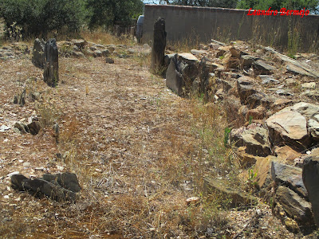 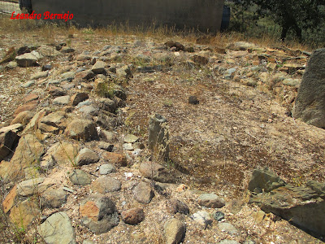 

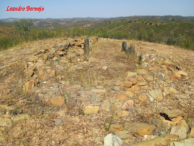 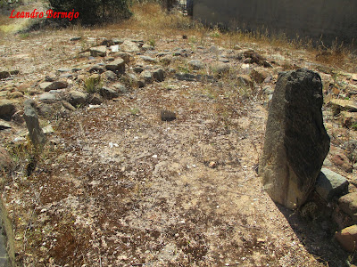 

## Dolmen del Mascotejo
El **dolmen de Mascotejo** se emplaza en la margen izquierda del río Tinto, en una zona de topografía plana, de lomas y pequeños cabezos, con suelos óptimos para actividades agropecuarias, con formación de dehesas de encinas, delimitado por los barrancos de Mansegoso al suroeste y El Lobo al este. Es un punto de paso natural y zonas de comunicación histórica en ese tramo del río Tinto, discurriendo junto al margen sur del dolmen una vía de comunicación romana que ha sido utilizada hasta recientemente como camino de herradura para el tránsito y la saca de la corcha, y que es conocida en la población como el _Camino del Moro_.

Este dolmen está compuesto por una galería y vestíbulo en rampa ascendente de acceso, cubierta y enmarcada por un túmulo de morfología oval, de 13,50 metros en el eje este-oeste y 10,50 metros en el eje norte-sur, con anillos de contención internos y un anillo peremitral constituido por lajas y bloques de piedras, que lo delimita mediante un escalonamiento con respecto a la cota del afloramiento de pizarra del firme externo. Al exterior del anillo, en el lateral noroeste, se presenta un altar sobre el que se depositaron materiales relacionados con los ritos funerarios.

La estructura megalítica se define como una galería trapezoidal de 6,30 metros de longitud, 0,90 metros de anchura en la entrada y 1,40 metro s en la cabecera, de espacio único, construida con ortostatos de ensanchamiento y altura progresiva desde el acceso hacia la cabecera. Su orientación es hacia el solsticio de invierno. Está  muy deteriorado como consecuencia de su reutilización como necrópolis en época romana y sus reiteradas expoliaciones. Así, se han documentado enterramientos (en cista y estructuras de incineración)de cronología romana en las zonas externas, que usan para su construcción los ortostatos del dolmen. Además la datación obtenida de un carbón del interior del dolmen en la época de Al Andalus (1172-1253) revela que este sitio ha sido un lugar de visita o frecuentaciones ocasionales, al localizarse al borde del _Camino del Moro_.

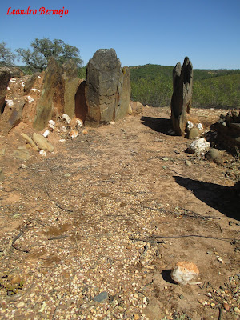 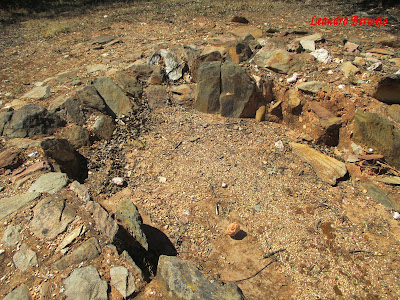 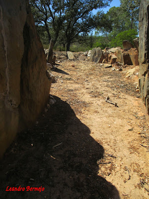 

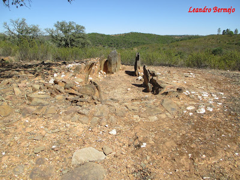 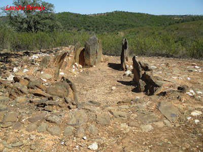 

## Documentos
* [GUÍA DEL MEGALITISMO EN LA PROVINCIA DE HUELVA. J.A. Linares](https://www.academia.edu/37341756/Gu%C3%ADa_del_megalitismo_en_la_provincia_de_Huelva_Una_visi%C3%B3n_de_los_territorios_paisajes_y_arquitecturas_para_la_difusi%C3%B3n_del_patrimonio_megal%C3%ADtico)
* [Megalitos de Huelva](http://megalitosdehuelva.blogspot.com/2015/07/casullo.html)
* [Intervención arqueológica de los dólmenes de Berrocal, Huelva](https://www.juntadeandalucia.es/cultura/tabula/bitstream/20.500.11947/27113/1/AAA_2005_495_linarescatelajoseantonio_dolemensdelberrocal_huelva_borrador.pdf)
* [Prospección arqueológica de los dólmenes de Berrocal de Huelva (II)](https://www.juntadeandalucia.es/cultura/tabula/bitstream/20.500.11947/27114/1/AAA_2005_496_linarescatelajoseantonio_dolemensdelberrocal_huelva_borrador.pdf)
* [Puesta en valor de los Dólmenes de Berrocal I, Huelva : Excavaciones arqueológicas y obras de consolidación](https://www.juntadeandalucia.es/cultura/tabula/bitstream/20.500.11947/3576/1/AAA_2006_223_linarescatela_dolmenesberrocal_huelva_borrador.pdf)
* [Puesta en valor de los Dólmenes de Berrocal II, Huelva: Prospecciones arqueológicas de superficie y análisis territorial de los monumentos megalíticos](https://www.juntadeandalucia.es/cultura/tabula/bitstream/20.500.11947/3585/1/AAA_2006_232_linarescatela_dolmenesberrocalII_huelva_borrador.pdf)

## Localizacion
Camino del Moro, Berrocal.

Coordenadas
* **Hornueco** lat: 37.593617, lon: -6.514897 
* **Mascotejo** lat: 37.573390, lon: -6.555226 

<iframe src="https://www.google.com/maps/embed?pb=!1m13!1m8!1m3!1d12645.370599569615!2d-6.514301!3d37.594094!3m2!1i1024!2i768!4f13.1!3m2!1m1!2zMzfCsDM1JzM4LjciTiA2wrAzMCc1MS41Ilc!5e0!3m2!1ses!2sus!4v1681575994737!5m2!1ses!2sus" width="600" height="450" style="border:0;" allowfullscreen="" loading="lazy" referrerpolicy="no-referrer-when-downgrade"></iframe>