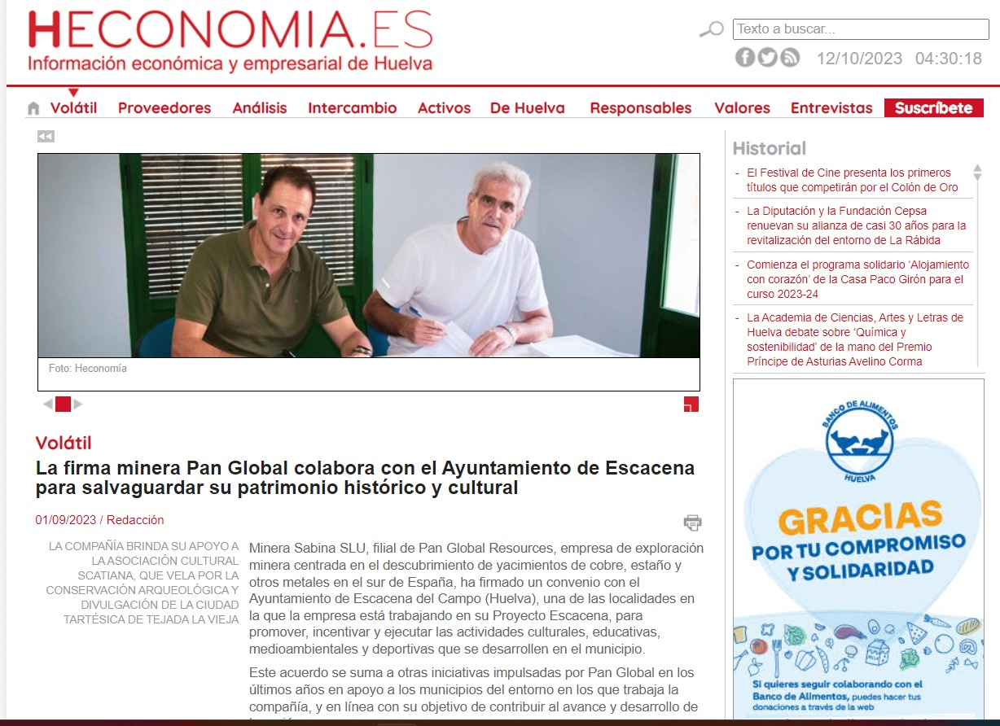
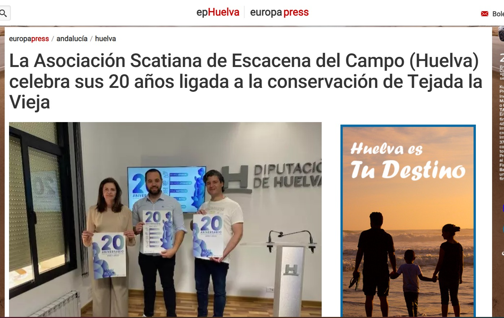
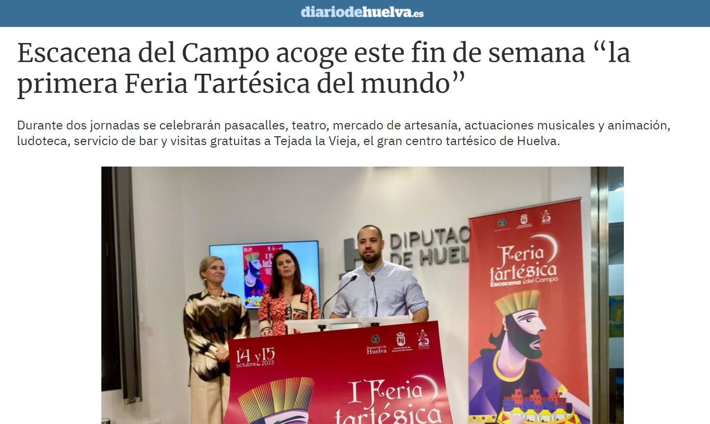

El pasado 1/9/2023 el medio Heconomia.es publica la noticia siguiente:

donde se indica que Minera Sabina SLU, filial de Pan Global Resources, ha firmado un convenio con el Ayuntamiento de Escacena del Campo para promover, incentivar y ejecutar las actividades culturales, educativas, medioambientales y deportivas que se desarrollen en el municipio. En dicho convenio, la compañía brindará su apoyo a la Asociación Cultural Scatiana.

 

Como ya han adelantado otras organizaciones, la compra de voluntades ya ha empezado. Continuaremos con la pérdida de paisajes y ecosistemas centenarios, así como los yacimientos arqueológicos de nuestra vecina Aznalcóllar, dentro del mismo contexto que Tejada la Vieja. Ahí es donde se unen los intereses por parte de todos los colectivos patrimonialistas en su defensa sin dejarse comprar y entendiendo que las aportaciones iniciales de la empresa minera son señuelos para hacerse atractivos a los pueblos. Por ello no entendemos que colectivos que se hacen defensores del legado comarcal acepten dinero a cambio de dejar a un lado sus humildes fines.

Sirva la presente para manifestar el rechazo de nuestra Plataforma a dichas prospecciones que den pie a tanta destrucción.

> "La mina es pan pa hoy, pero hambre pa mañana"