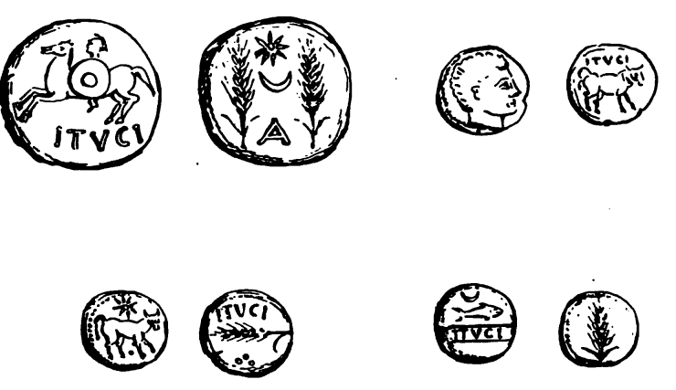
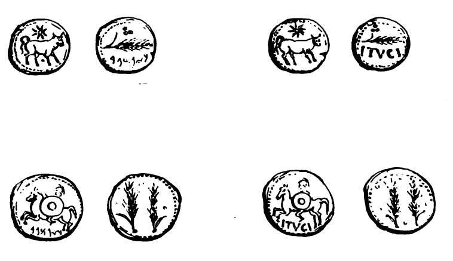

 

Los tipos de monedas halladas en Tejada se pueden agrupar en cuatro o cinco fases de acuñación. El primero corresponde a ases y semis con un peso que se puede equiparar con el de los ases romanos acuñados a partir de ca. 206 a.C. y hasta mediados de siglo. Las restantes fases se emitieron con un patrón de peso mucho más ligero, de ca. 10-11 g (unidades, mitades y cuartos), que se aligeró en las sucesivas emisiones, hasta situarse en 8-8,5 g (_MIB_ 26/8-10). El tipo _ACIP_ 842 (= _CNH_ 108/4 = _DCPH_ II: 217, nº 2ª 4 = Sáez y Blanco 2001: I, 2a) con “escudo redondo adornado con una estrella” corresponde a monedas que en realidad son como ACIP 841 (= MIB 26/3), sobre cuyo escudo se ha aplicado cuidadosamente una contramarca con una estrella, con un punzón circular.

La representación de un fruto de la tierra se repite en todas, en concreto una espiga de cereal. Sin embargo respecto a este tema, ciertos sectores de la investigación numismática tienen reservas a la hora de considerar estas representaciones como un indicador económico, viendo por el contrario en las mismas un elemento religioso. Así, las representaciones zoomorfas o vegetales son consideradas como encarnaciones de divinidades (caso del toro: Baal Hammon) o expresiones de una determinada divinidad (atunes o espigas); o como la expresión de una actividad económica determinada (atunes, espigas) sin negar por ello la hipótesis anterior en su conjunto. Ambas hipótesis interpretativas resultan válidas, ya que en el mundo antiguo el poder político- económico y religioso podía estar en manos del mismo grupo social cuando no en la misma persona (casos de la casta sacerdotal egipcia que controlaba prácticamente la economía del Estado, o de los emperadores romanos, que ostentaban también el título de Pontifex Maximus). El jinete con rodela ha sido relacionado con la caballería númida y se ha considerado como un testimonio de la presencia de mercenarios durante la ocupación bárcida.

Las representaciones serían las siguientes: 

* **Tipo púnico:** la espiga está presente en el reverso de las dos variantes que podemos encontrar dentro de este tipo, aquellas que en el anverso llevan un jinete con lanza y leyenda púnica y las que llevan un toro a la derecha y encima un sol de ocho rayos (éstos últimos considerados como símbolo astral-solar de algunas divinidades fenicio-púnicas. MORA SERRANO, 1993: 75). En ambos casos, la espiga del reverso se completa con leyenda púnica.
* **Tipo bilingüe:** en este caso la espiga forma parte también del reverso de la única variedad que existe, esto es una moneda con valor de semis que presenta en el anverso un toro junto a un sol y la leyenda ITUCI.
* **Tipo latino:** en el último tipo, la representación de espigas está presente en el reverso de las dos clases de monedas existentes, los ases y los semises. En los ases, en vez de una sola espiga, aparecen dos, completadas por un sol de ocho puntas que se sitúa entre ambas. En el caso de los semises de nuevo aparece una sola espiga, pero situada de forma horizontal y completada con la leyenda ITUCI debajo. 