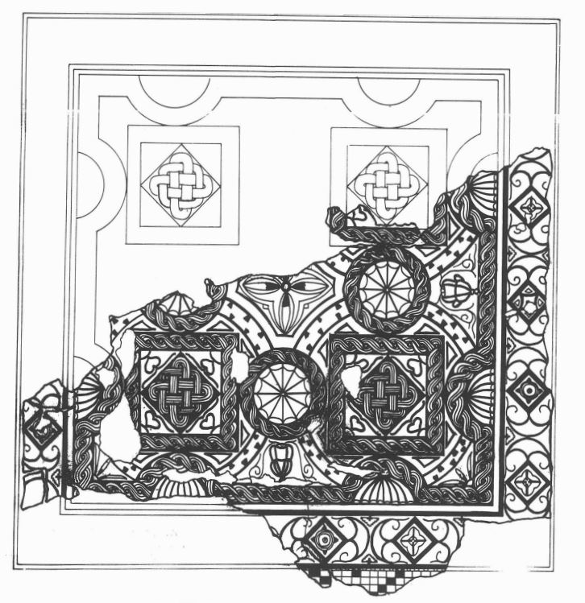

Se trata de un pavimento de "Opus Tesellatum" polícromo, en el que se han empleado teselas de tamaño regular de un centímetro.

Presenta una composición de motivos geométricos. Un tapiz bordeado por dos cenefas, una primera en ajedrezado de la que apenas quedan algunos restos, y una segunda de volutas enfrentadas en cuyo centro aparece un cuadrado apoyado en sus vértices, con diferente decoración en su interior dispuesta de forma alternativa. 

El tapiz central presenta una composición de forma cuadrangular, empleando motivos vegetales y geométricos. 

En el centro encontramos un florón de cuatro lóbulos, eje de toda la composición.

 A su alrededor se distribuyen cuadrados y círculos alternándose unos con otros. 

Los cuadrados formados por trenzas de dos cabos, en cuyo interior se inscribe otro cuadrado con un entrelazado de trenzas de tres cabos. 

Los círculos formados igualmente por trenzas de dos cabos en los que encontramos inscritas ruedas de doce radios. 

En los bordes medios, cráteras semejantes entre sí, a cuyos lados se disponen semicírculos radiados.

Una trenza de doble cabo se distribuye alrededor de todo el borde.