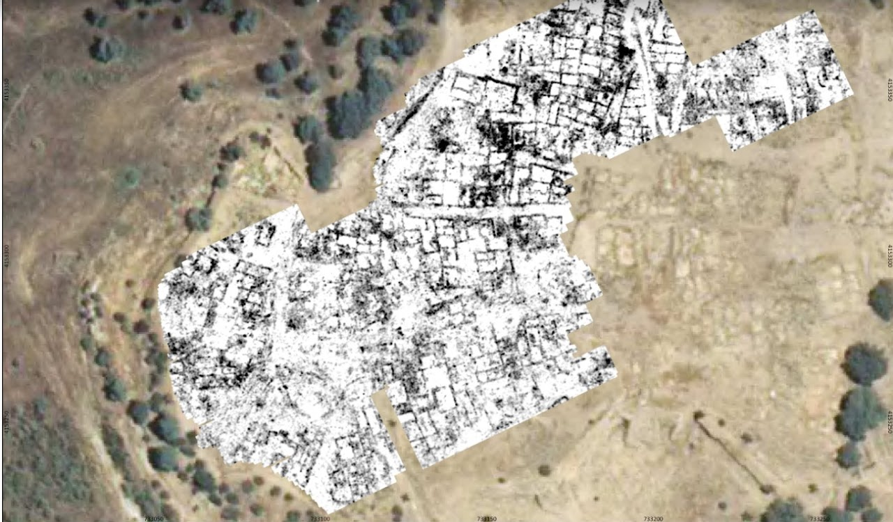

Realizadas en Abril de 2017 por Cornelius Meyer de la empresa Eastern Atlas GmbH und Co KG y Roger Sala Bartrolí y Helena Ortíz-Quintana, SOT Prospecció Arqueológica de Barcelona.

Publicadas en el X Encuentro de Arqueología del Suroeste Peninsular realizado en Zafra en Noviembre 2018.

Se elaboró ​​un diagrama de interpretación para mostrar la red urbana proponiendo una subdivisión según diferentes zonas urbanas divididas en al menos 15 grupos de construcción.

