Contiene un variopinto conjunto de ecosistemas, desde bosques endógenos de encinas y alcornoques, hasta eucaliptos, praderas, matorrales y pastizales, todos ellos en el **núcleo forestal de la Pata del Caballo** (Escacena del Campo). En éste podemos encontrar elementos destacables como:

Cumbres: cuya corona es el Alto del Cejo, observatorio natural que domina la campiña y el Aljarafe sevillano.

Barrancos: de los que destaca el barranco de Los Laureles, con la aliseda más meridional de Europa con una extensión de 1,5 Ha, y está incluida en Listado de Árboles y Arboledas Singulares de Andalucía. Se trata de un bosque de ribera donde crecen musgos y helechos gracias a su elevada humedad que aporta el agua cristalina y ferruginosa del arroyo de los Laureles.

Nacimiento del río Corumbel: sus aguas subterráneas emergen a un kilómetro de profundidad del Alto del Cejo, formando posteriormente manantial que surte a dos embalses sirve de abrevadero para ciervos y jabalíes.

Arqueología: Habitada desde tiempos inmemoriales, como lo atestiguan restos megalíticos y calcolíticos, la sierra de Tejada siempre tuvo el interés de las vetas de mineral que afloran como en toda la franja pirítica dando pie a un importante patrimonio arqueológico compuesto de _Minas_, como la del Carmen, Trinidad, Los Laureles y la Cueva del Monge; _Fortificaciones romanas_, como los atajuelos, la torre de los Perros o El Castrejón, todos ellos cerros encastillados para el control de las vías de comunicación; y _antiguas ciudades_ como Tejada la Vieja, declarada Bien de Interés Cultural con la categoría de Zona Arqueológica y Paisaje Protegido de Andalucía, y la ciudad romana de Ostur, aun por excavar.

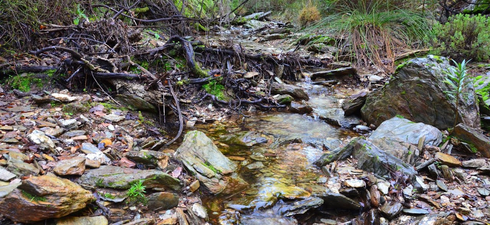

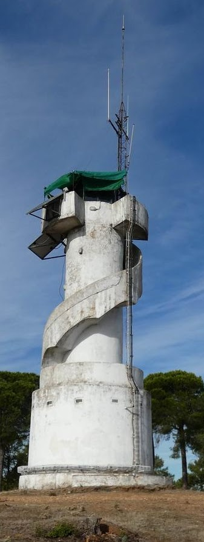 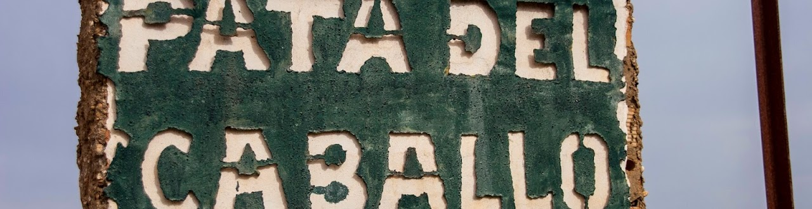

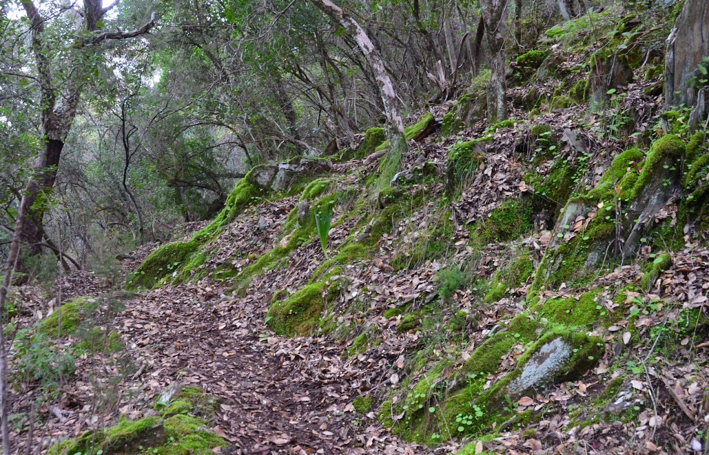

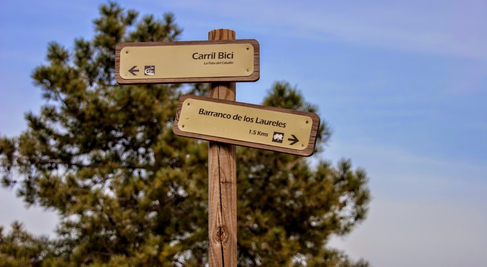 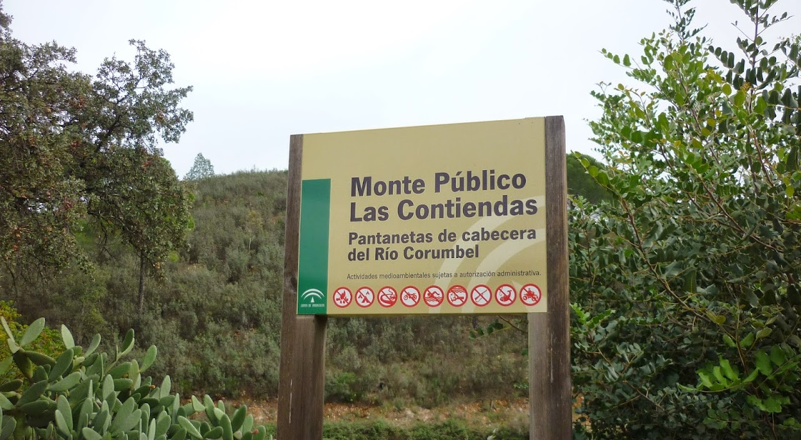

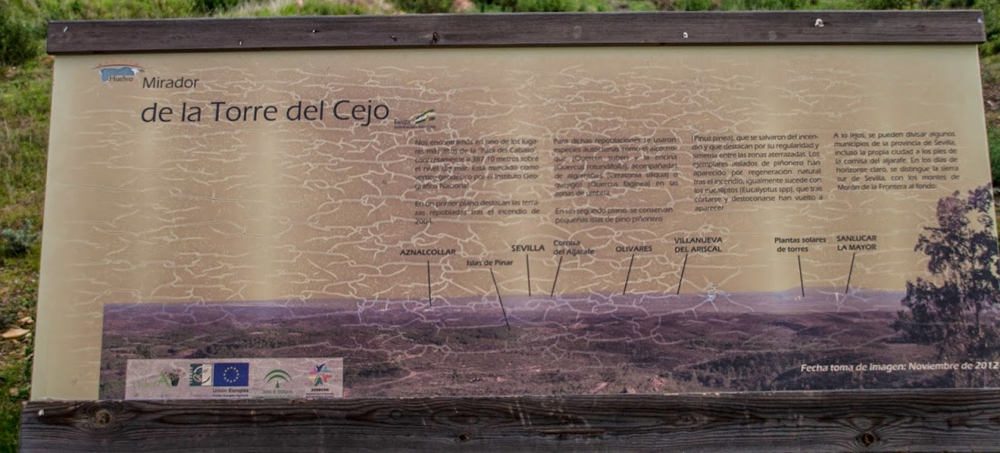

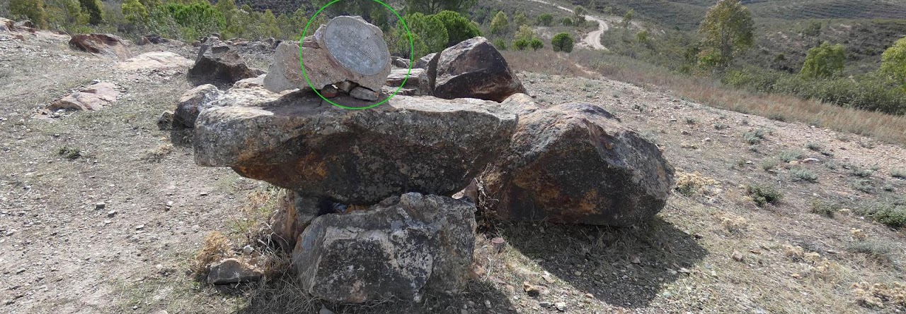

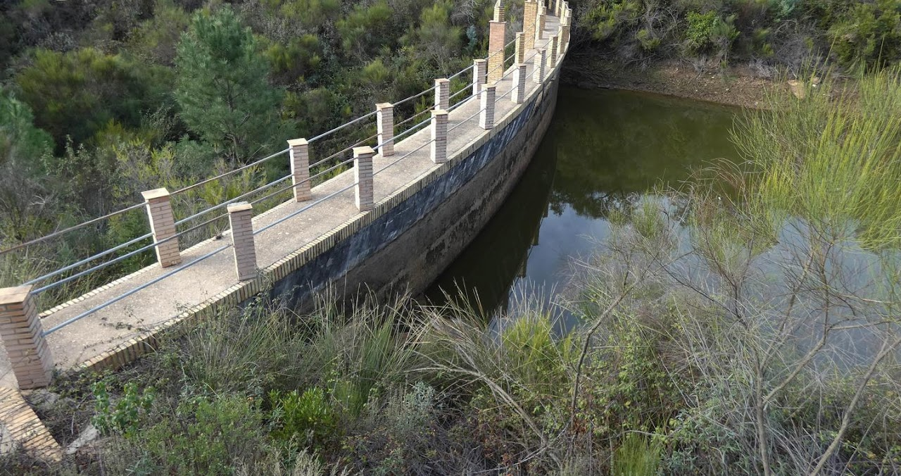 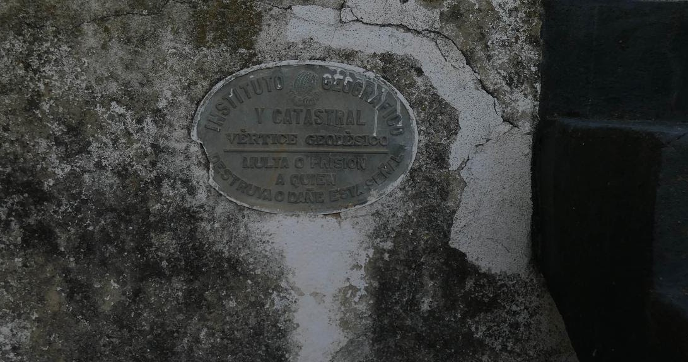

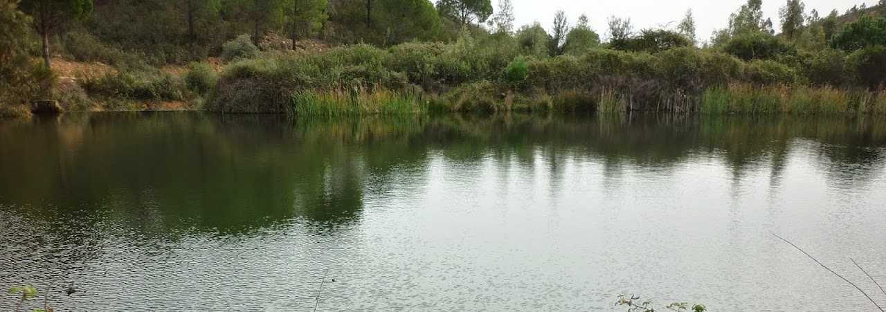