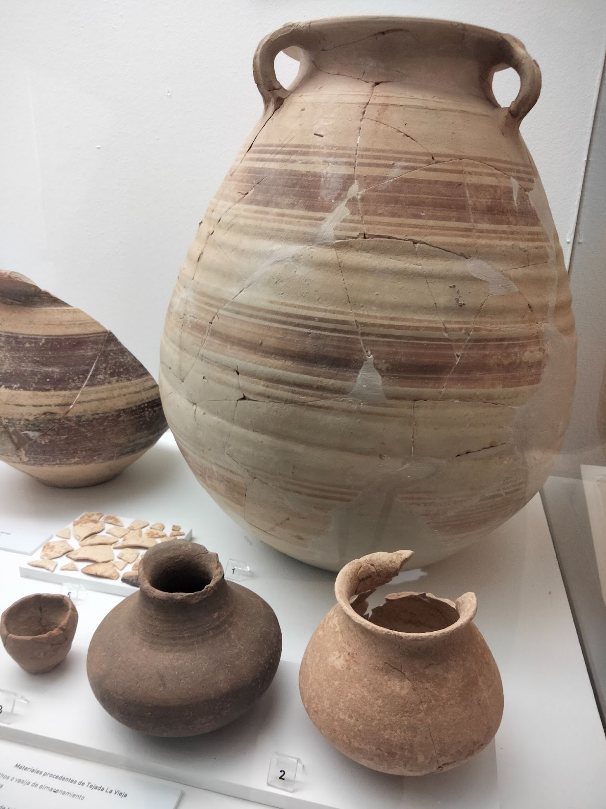
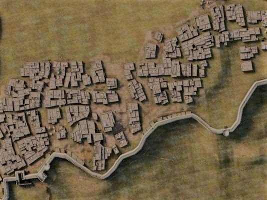
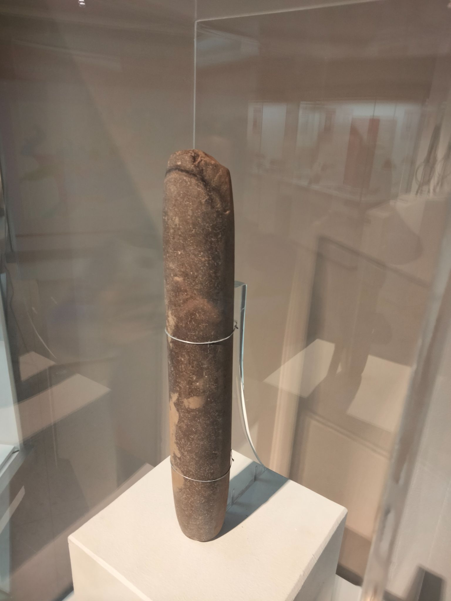
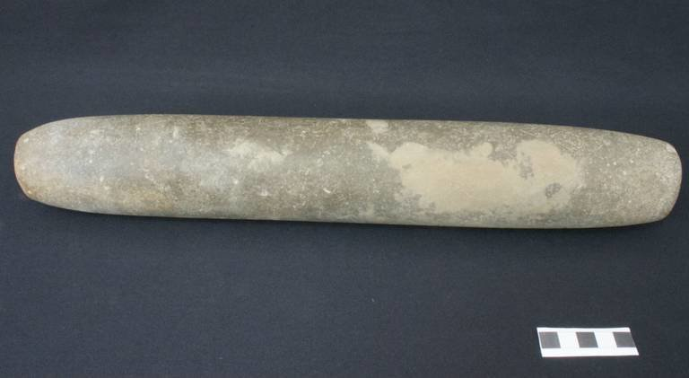
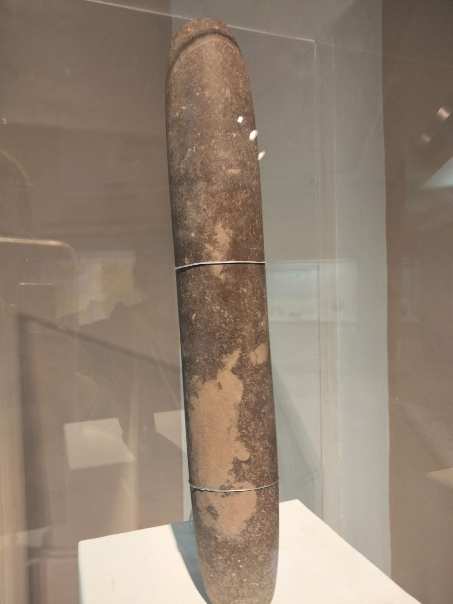
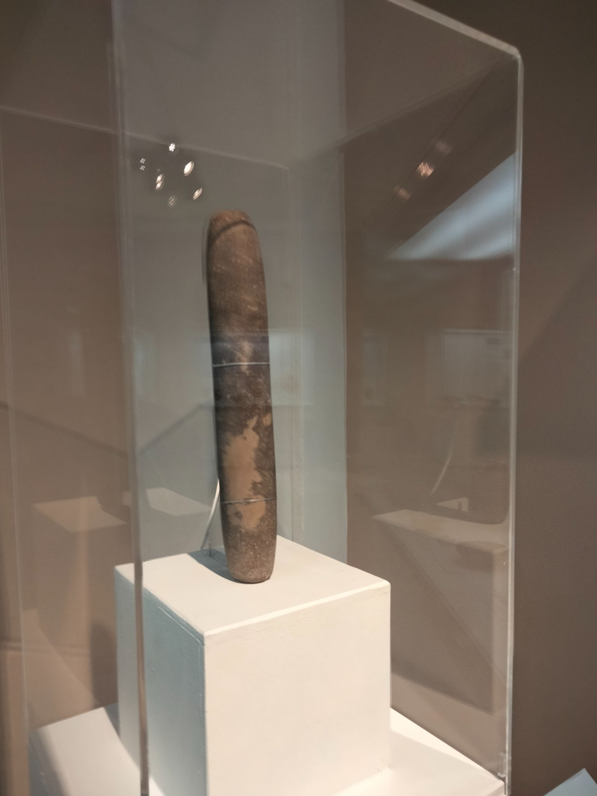
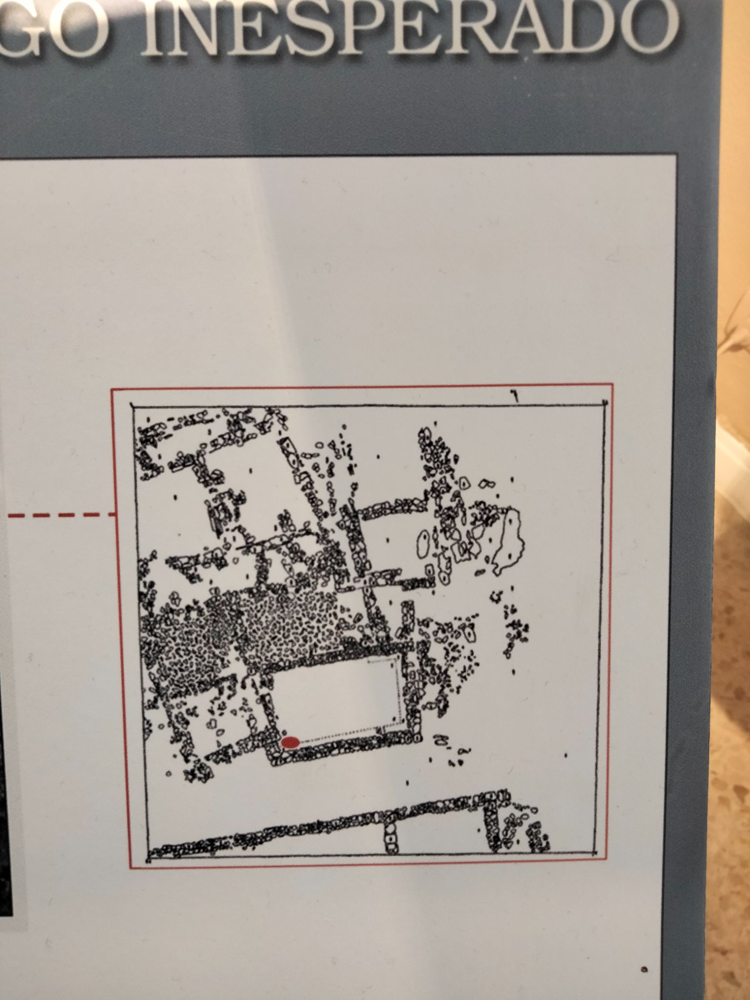
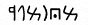
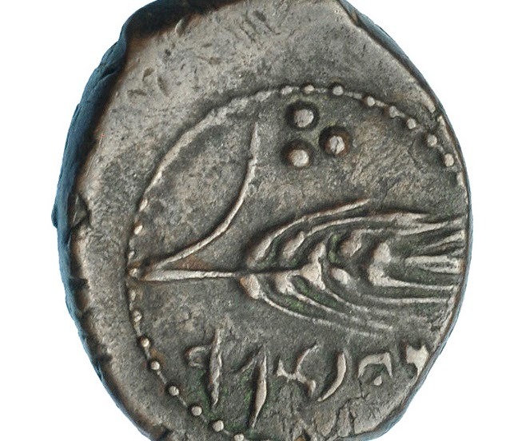

## Antecedente de Tejada
### Poblado de Peñalosa
Las investigadoras Carmen García y Pilar Rufete definieron a Tejada la Vieja como un núcleo aglutinador de pequeños poblados que dominaban la antigua campiña, cosa que constató nuestro vecino apodado "el meri" con un hallazgo en el Cortijo de Peñalosa-

Mientras pastaba con sus ovejas a escasos kilómetros de la ciudad tartésica de Tejada la Vieja, localizó varios restos cerámicos que enseñó a Jesús Fernández Jurado que se encontraba interviniendo en las excavaciones arqueológicas. Inmediatamente comenzaron a realizar pequeñas catas arqueológicas que reveló la existencia de un poblado indígena del Bronce Final, de cabañas de plantas ovaladas y circulares sin un ordenamiento o planificación previa ni sistema defensivo, pero con condiciones geográficas inmejorables desde el punto de vista agrícola cerealista, lo que debió influir en la elección del mismo para dicho asentamiento.

La cerámica hallada se componía de dos tipos muy diferenciados: un tipo de cerámica realizada a mano de forma tosca (propia de la población indígena) y rudimentaria, y otra a torno, bruñida y decorada con engobe rojizo datada en el S.VIII a.n.e, periodo correspondiente con la fundación de Tejada la Vieja (propia del pueblo fenicio). Por ello Peñalosa se convirtió en referencia respecto al modelo de vida previo a la llegada de los fenicios al Sudoeste ibérico. 

En los fondos de cabaña se encontraron restos de escoria de plata y restos de plomo, lo que demuestra es que se utilizaba la técnica de la copelación.

Se tenía constancia que dicha técnica fue aportada por la colonización fenicia por lo que su hallazgo en Peñalosa demuestra que la copelación ya se conocía entre la población autóctona o que los contactos comerciales con el pueblo fenicio se produjo antes de lo que se creía.

[Más información](https://www.juntadeandalucia.es/cultura/tabula/bitstream/20.500.11947/16202/1/AAA_1990_060_fernandezjuado_pe%c3%b1alosa_huelva.pdf)

### El Yacimiento
Tejada la Vieja es un yacimiento arqueológico tartésico-turdetano cuya fundación se data en el S. VIII a.n.e. y se justifica ante la cercanía a las explotaciones mineras de Aználcollar y Río Tinto. Fue contemporánea a la del [Castillo de Doña Blanca (Cádiz)](https://es.wikipedia.org/wiki/Castillo_de_Do%C3%B1a_Blanca), la Ilipla tartésica (Huelva) y del complejo religioso del Carambolo (Camas), y precedente de otras ciudades, más al interior, en la Vega del Guadiana como [El Turuñuelo](https://es.wikipedia.org/wiki/El_Turu%C3%B1uelo) de Guareña y [Cancho Roano](https://es.wikipedia.org/wiki/Cancho_Roano).

D. Antonio Blanco Freijeiro fue el primero que localizó el yacimiento basándose en la tradición oral y escrita ( Silverio Escobar en su [Noticia histórica de la Villa de Escacena](https://dialnet.unirioja.es/servlet/articulo?codigo=2478023) publicado en 1910 y [Juan Aurioles y Galbán](https://dialnet.unirioja.es/descarga/articulo/70319.pdf), párroco de Paterna del Campo, en respuesta al diccionario geográfico de Tomás López a fines del siglo XVIII). Junto a  [Beno Rothemberg](https://www-tau-ac-il.translate.goog/~ebenyose/CTV/rothenberg/index.html?_x_tr_sl=en&_x_tr_tl=es&_x_tr_hl=es&_x_tr_pto=sc), estudiaban la arqueo-metalurgia en la provincia de Huelva, pero dada la importancia de las ruinas visibles, excavó dentro del recinto. Su intervención se centró en la muralla sacándola a la luz y practicando técnica invasiva  consistente en cortarla para verificar la forma de construcción, quedándose a la vista dicho corte hasta su reciente cierre evitando una interpretación errónea. 

En 1981 publicaron "Exploración arqueometalúrgica en Huelva", y dio pie para que un año más tarde la Diputación de Huelva adquirió los terrenos por mediación de Jesús Fernández Jurado y continuaran las sucesivas campañas durante le resto de esa década y parte de la siguiente.

En 2007 Tejada la Vieja fue declarada Bien de Interés Cultural con la categoría de Zona Arqueológica, pero no repercutió sobre el yacimiento ya que en pocos años se vio inmerso en un periodo de abandono al desaparecer el Servicio de Arqueología de la Diputación de Huelva que lo custodiaba..

Tras quejas a las instituciones, la Diputación cedió la gestión temporal a la Universidad de Huelva que, junto al Ayuntamiento de Escacena del Campo y el grupo Vrbanitas de la universidad, comenzó una campaña de mantenimiento.

### La Muralla
Sin duda se trata del elemento más característico e imponente del actual yacimiento. Fue construida en el S. VIII a.n.e. con cierta antelación a la misma fundación de la población, lo que explica que sus constructores ya contaban con una planificación urbana. Dicha planificación y la característica de haber estado enlucida y encalada con idea de prestigio, son elementos propios de influencias orientales traídas propias del mundo fenicio.

La técnica constructiva es bien sencilla puesto que sobre el propio cerro, y adaptándose a sus irregularidades, se levantan dos muros paralelos de piedra caliza del lugar y se rellena su interior con escombros de piedras, tierras y restos cerámicos compactados.  A lo largo del perímetro de más de un kilómetro se coloca una hilera de piedra pizarra sobre la parte inferior como refuerzo, conocido como _pie de amigo_. Sobre esta base se levantaba una superestructura de tapial o barro prensado alcanzando algunos puntos hasta seis metros de altura y se reforzaba con bastiones o torretas y contrafuertes circulares (coetáneos a la construcción de la muralla) y cuadrangulares (posteriores refuerzos de la muralla en aquellos puntos donde se estimase conveniente). 

### Economía y sociedad 
Los fenicios provenían de la [región de Canaán](https://es.wikipedia.org/wiki/Cana%C3%A1n) o Fenicia que disponía de una estrecha franja costera de 40 km de terreno, por lo que su pueblo se vió obligado a comerciar a través de su flota con otros pueblos costeros. Ese carácter comercial con la metalurgia, los excedentes agrícolas y el intercambio de objetos preciosos, definieron la nueva cultura tartésica que derivó de la colonización. 

En Tejada la Vieja no han aparecido hasta el momento restos que hablen de una gran actividad de transformación metalúrgica, lo que ha llevado a pensar a quienes la han excavado que su función no era la de un gran centro transformador sino la de un lugar de recepción, primera transformación y distribución del material.

A cierta distancia, en el denominado [Cerro de la Matanza](https://cartographic.info/espana/map.php?id=452913) y en Tejada denominada _"la nueva"_ aparecieron restos de cerámicas orientalizantes, lo que induce a pensar a que junto a la ciudad existían poblaciones satélites que debieron practicar también actividades agropecuarias que sirvieran de abastecimiento de la urbe. 

La planificación urbanística de Tejada la Vieja, la construcción de edificios públicos, de uso comunitario o de uso religioso hace ver una estructura social lo suficientemente compleja como para desarrollar todo esto, con una clase política, una clase religiosa y una clase trabajadora con gremios especializados en sus respectiva tareas.

El cuanto al aspecto religioso no podemos profundizar al no haberse localizado aún su necrópolis, pero la aparición de un **[betilo](https://www.europapress.es/andalucia/fundacion-cajasol-00621/noticia-museo-huelva-incorpora-fondos-betilo-hallado-tejada-vieja-20160409154740.html)**  (similar [al del Turuñuelo](https://www.researchgate.net/figure/Figura-12-Betilo-cilindrico-documentado-en-la-UE-511-de-la-estancia-S-1-del-yacimiento_fig3_337917987)) y el posible uso religioso de uno de los edificios hasta ahora descubiertos parece que se trataba de una población de mezcolanza. Mientras que el betilo recuerda a religiosidades arcaicas del culto a la piedra y a la madre tierra, la posible existencia de un templo hace pensar que se convivía con un culto más elaborado o complejo y con deidades más humanizadas pero sin perder nunca la vinculación con la naturaleza porque, como buenos navegantes, los fenicios miraban y se guiaban por los astros. Por esto mismo su deidad masculina principal Baal se representaba con el sol a modo de estrella de ocho puntas, dando lugar posteriormente a la denominada [estrella tartésica](https://es.wikipedia.org/wiki/Estrella_de_ocho_puntas).

### Los betilos de Tejada la Vieja
El descubrimiento de este betilo tuvo lugar como consecuencia de una simple limpieza superficial encaminada a la consolidación de las estructuras del yacimiento, y desde su estudio se encuentra expuesto en el Museo de Huelva.

Sin embargo en sus almacenes se encuentran pendientes de limpieza y estudio piezas importantísimas de intervenciones anteriores como un segundo betilo hallado en uno de los edificios de la ciudad catalogado como posible templo, cosa que tras ratificarse, conformaría un uso religioso de dicho edificio.

  

   

**pero... qué es un betilo?**
Etimológicamente este término proviene del hebreo “Beth-El” que significa “recuerdo de los dioses”, por lo que es empleado para referirse a una piedra o roca sagrada. En la civilización semítica es empleada para denominar a las partículas de meteoritos que caían a la tierra, por lo que cualquier roca levantada simbolizaba la presencia de la deidad y la ubicación de un lugar sagrado.  Como ejemplo, mencionamos uno de los más célebres: la piedra negra de la Kaaba ubicada en la Meca.

### Urbanismo
Las 1,5 Ha intervenidas de las 6,5Ha existentes presenta un urbanismo repartido en tres terrazas escalonadas que hace el propio terreno y deja ver una división en manzanas perfectamente delimitadas unidas por calles y plazas. Sin embargo dentro de éstas reina el caos organizativo, más característico de oriente donde las estancias habitadas se mezclan con patios interiores, corralones, callejones, pasadizos y parcelas totalmente irregulares.

Las manzanas no parecer presentar un uso definido por lo que se pueden observar viviendas con edificios públicos y de diferentes usos dando una fotografía de los últimos días de vida de la ciudad.

Los restos descubiertos se basan en un zócalo de caliza mezclada con pizarra para su nivelación sin ningún tipo de cimentación, y con diferentes grosores en función de la altura o envergadura del edificio. En uno de los edificios, este zócalo tiene adosado un banco corrido en el lado interior. El resto del cuerpo de los muros se levantaba con [adobe](https://es.wikipedia.org/wiki/Adobe) o barro prensado, de ahí que no se hayan conservado, como tampoco lo ha hecho la techumbre que se sospecha que fuese vegetal. La excepción a esto último la tenemos en uno de los edificios públicos posiblemente dedicado a la producción o almacenamiento de vino en cuyas ruinas aparecieron numerosas pizarras dando a entender la posibilidad de que algunos tuviesen la cubierta con este material a modo de terraza, como es típico aún en muchos lugares del Mediterráneo.

## El nombre de Tejada la Vieja  'typbtr 
La lectura de la leyenda púnica de las monedas halladas en Tejada "la nueva" es bastante incierta, pues existen diferencias en la identificación de los signos y en su valoración. Mientras los expertos Solá Solé (1980: 75), García-Bellido (_DCPH_ II: 216) y Pérez Orozco (2009) propusieron _’ypbtk_, Jenkins (1979) leyó ?_ypbtr_ y Alfaro _’ypbtr_ (Alfaro 1997: 103-104). En esta leyenda el primer y cuarto signo son iguales y esa grafía ha sido identificada como la letra _šin_ en Ebusus, pero como taw en la leyenda de Ituci. No hay seguridad de que la leyenda en púnico repita o incluya el topónimo latino ITVCI; en el [Proyecto Moneda Ibérica](https://monedaiberica.org/v2/) de la Universitat de València se ha optado por la transcripción _typbtr_, aunque no deja de ser dudosa.

 

## Documentacion
* El suroeste hispano en la Turdetania atlántica I
* El suroeste hispano en la Turdetania atlántica II
* Murallas fenicias para Tartessos
* Arqueología del cielo. Orientaciones astronómicas en edificios protohistóricos del sur de la península Ibérica
* Arquitectura y urbanismo de Tejada
* Antecedentes históricos del Campo de Tejada
* El yacimiento y su excavación
* Campañas de excavación
* Indígenas y fenicios en Huelva
* Aspectos de la minería y la metalurgia en la protohistoria de Huelva
* Peñalosa (Escacena del Campo, Huelva)

## Visita virtual
Recorre el yacimiento con las explicaciones de la arqueóloga Clara Toscano y adéntrate en el legendario reino de Tartessos. Recorre las calles que pisaron sus habitantes en el siglo IV a.n.e. Contempla las murallas que construyeron para proteger sus riquezas minerales. El legado que la civilización tartésica nos dejó, te espera.

* [Descarga para Android](https://play.google.com/store/apps/details?id=david.tejadalavieja&pli=1)
* [Descarga para iOS](https://apps.apple.com/us/app/tejada-la-vieja/id1619742057)

## Localizacion
**NO SEGUIR GOOGLE MAPS**
* **Desde Escacena:** Tome la salida en dirección Aznalcóllar. Siga HU-6110 durante 8 km. Gire a la izquierda hacia  la Cañada Real del Arrebol hasta el final del camino.
* **Desde Aznalcóllar:** Tome la salida en dirección Escacena. Siga SE-4400 durante 7 km. Gire a la derecha hacia la Cañada Real del Arrebol. 

<iframe src="https://www.google.com/maps/embed?pb=!1m13!1m8!1m3!1d50646.41557104604!2d-6.34793!3d37.49846!3m2!1i1024!2i768!4f13.1!3m2!1m1!2zMzfCsDI5JzUwLjMiTiA2wrAyMSczMC42Ilc!5e0!3m2!1ses!2sus!4v1681578553985!5m2!1ses!2sus" width="600" height="450" style="border:0;" allowfullscreen="" loading="lazy" referrerpolicy="no-referrer-when-downgrade"></iframe>