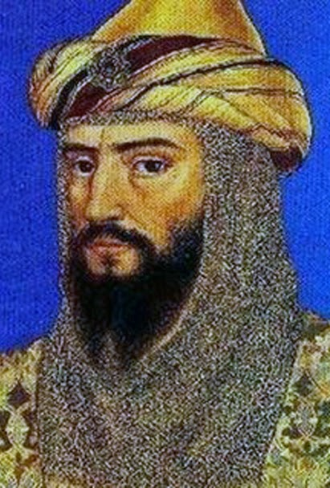

     

     

Tejada presenta un periodo de ocupación continua desde época turdetana hasta prácticamente el siglo XVI. En época turdetana se construye una muralla, que  posteriormente será reutilizada por los romanos y de nuevo por los almohades. De la primera cerca no existen evidencias arqueológicas, sin embargo de la construida en época romana aún se pueden observar algunos restos en superficie. Blanco Freijeiro y Beno Rothenberg (1981) aventuraron una hipótesis novedosa al considerar la posibilidad de que el origen de Tejada la Nueva podría haber estado en el traslado de población que desde el cercano enclave ele Tejada la Vieja debió haberse producido en algún momento de la conquista cartaginesa del SW peninsular, y más concretamente durante el mando de [**Amílcar Barca**](https://es.wikipedia.org/wiki/Am%C3%ADlcar_Barca).

Investigaciones recientes (VIDAL TERUEL. 1996: CAMPOS CARRASCO VIDAL TERUEL, e.p.) han puesto de manifiesto que el origen del poblamiento de este núcleo habría que remontarlo a momentos anteriores a las épocas iberico-turdetana o romana. La aparición de algunos fragmentos de material lítico y de producciones cerámicas a mano bruñidas, revela indicios de una presencia humana ya desde fines del primer milenio: presencia, que si bien en el estado actual de las investigaciones no podemos calificar aún de estable o continuada, si constituye un primer avance para considerar que este núcleo formó parte de la estructura de poblamiento de la campiña oriental desde los comienzos de la protohistoria.

Más tarde aparece nombrada con asiduidad en los itinerarios romanos y medievales: en el primer caso (Itinerario de Antonino. 432) bajo el topónimo TUCCI, en el segundo (Anónimo de Rávena. 417) con el nombre de TUSCI. 

Este mantenimiento constante de la población a través del tiempo no hubiera sido posible de no haber dispuesto de unas condiciones naturales y económicas favorables. De este modo las condiciones físico-naturales y la orientación económica de Tejada la Nueva hubieron de tener, a nuestro juicio una característica principal: la estabilidad de un medio físico favorable y un clima benévolo. Ello se tradujo, en el aspecto económico, en la disponibilidad de un suelo de una altísima calidad agrológica y notablemente fértil a lo largo de su historia.

## Localizacion
* **Desde Escacena:** Tome la salida en dirección Aznalcóllar. Siga HU-6110 durante 5 km. Gire a la izquierda hacia la Vereda de Huévar.
* **Desde Aznalcóllar:** Tome la salida en dirección Escacena. Siga SE-4400 durante 10 km. Gire a la derecha hacia la Vereda de Huévar. 

<iframe src="https://www.google.com/maps/embed?pb=!1m13!1m8!1m3!1d6335.05156656794!2d-6.366163!3d37.448306!3m2!1i1024!2i768!4f13.1!3m2!1m1!2zMzfCsDI2JzUyLjIiTiA2wrAyMSc1Ny43Ilc!5e0!3m2!1ses!2sus!4v1681576154075!5m2!1ses!2sus" width="600" height="450" style="border:0;" allowfullscreen="" loading="lazy" referrerpolicy="no-referrer-when-downgrade"></iframe>

## Itvci Romana
La importancia de la agricultura como fuente principal de la economía de la ciudad y de todo el Campo de Tejada y en general de la Bética se puede rastrear a través de otro hecho: la presencia de villae. Éstas podían presentar distintas cara que en esencia definían dos tipos: la villa de lujo, lugar de retiro y descanso para los grandes propietarios: y la villa rústica, entendida como centro de explotación agrícola. Las villas béticas se ubicaban con frecuencia junto a tina red fluvial o en la línea de la costa. Así, estos lugares se muestran no sólo como centros agrícolas, sino también comerciales. Afinando el margen espacial y pasando con ello al análisis del segundo tipo de fuentes, las arqueológicas, podemos observar como en el Campo de Tejada se cumplen dichas características. Gracias a los trabajos de prospección y excavación llevados a cabo por Silliéres (1981) en el término municipal de la Palma del Condado se puso de manifiesto la existencia de nueve villae romanas situadas en torno a una ruta de gran importancia comercial y agrícola como la Vereda de la Carne. En el caso concreto de Tejada la aparición de una villa situada a unos 800 mts al NW (BEDIA, 1987) de la ciudad y que en principio podría interpretarse como parte de un cordón de villae que rodeasen la ciudad, estaría confirmando la existencia de una actividad agrícola de cierta importancia, que permitió su mantenimiento durante un período determinado.

Junto a esto hay otro hecho del que podemos deducir la prosperidad que caracterizó agrícolamente a la zona y éste no es otro que el de la adscripción de las tierras del Campo de Tejada. Su consideración como "_tierras de realengo_" nos está hablando de la gran importancia que hubieron de alcanzar las mismas, llegando al extremo de quedar incluidas como parte del patrimonio real, deseo expreso de Alfonso X, y sujetas a sus leyes y explotadas directamente por él y su familia. Respecto a la producción, si hasta ahora el olivar era el rey indiscutible en los cultivos campiñeses, será durante la Baja Edad Media cuando el predominio del olivar en todo el área de Tejada ceda terreno en favor de la producción vinícola, como se deduce del hecho del aumento del número de propietarios de tierras vinícolas respecto a los de olivar (que se centraban en los monopolios de los grandes propietarios sevillanos y geográficamente empezaban a ser cultivos marginales en el contexto del Campo de Tejada y de todo el Aljarafe) (BORRERO FERNÁNDEZ, 1983, 1986). La importancia creciente del cultivo de la vid se verá acompañado en este proceso por el cereal. Junto a la vid, el cereal será el otro punto de apoyo de las labores agrícolas del campo de Tejada durante la Baja Edad Media y el tránsito a la Modernidad. Las cifras que apoyan la orientación mayoritariamente agrícola de la zona quedan recogidas en los padrones de población de fines del siglo XV. En ellos se puede observar como más del 80% de la población está adscrita al sector agrario. Nos encontramos pues, con una población mayoritariamente campesina y por lo tanto con una economía basada casi de forma exclusiva en las actividades agrícolas.

La dedicación agrícola se vio acompañada por una actividad ganadera que, si no ya en la antigüedad, si se afianzó en época medieval. Desgraciadamente nos ha sido difícil encontrar estudios dedicados al tema de la ganadería para los momentos antiguos. Sin duda las referencias más importantes se encuentran en diferentes artículos de J.M. Blázquez recogidos en Economía de la Hispania Romana (1978 a, b, c) y en obras posteriores (1987). Sin embargo y apesar de esta carencia, si nos es posible detectar la importancia de esta actividad durante la época romana e incluso referencias a momentos anteriores gracias a los datos aportados por algunas fuentes romanas. Así, Estrabón afirmaba de la Turdetania que "**_la abundancia de ganados de toda especie es allí enorme, así como la caza_**" (Geografia,3,2,6). También al-Udri, en sus Fragmentos geográfico-históricos, y alHimyari en el Kitab al Rawd señalaban que ya en el siglo XII como estas tierras eran famosas por la calidad de sus caballos y el número de cabezas de ganado bovino. Pero será en época cristiana donde encontraremos mayor abundancia de testimonios del uso ganadero en el Campo de Tejada. Y de nuevo recurrimos para apoyar dicha afirmación a dos obras ya mencionadas: el Libro del Repartimiento de Sevilla y su tierra (1253) y los Diplomas de Repartimiento de Alfonso X, recogidos y analizados por González Jiménez (1991) en el Diplomatario Andaluz de Alfonso X En ambas encontramos evidencias de un uso ganadero en la zona. Respecto a los diplomas de repoblación de Alfonso X, observamos como se manda a los vecinos de la zona de Sevilla (y demás poblaciones de "su tierra") cumplir con el deber de pagar a la Iglesia los impuestos correspondientes (diezmo) en cereal, vid y ganado: ... "**_Et mandamos que de pan et de vino, et de ganado el de todas las otras cosas, que dedes vuestro derecho a la Eglesia..._**" (GONZÁLEZ, 1991:82) . En el mismo documento también encontramos información sobre el tipo de ganado al uso durante el siglo XIII: "**_...Et quítoles todo el portadgo e el derecho que me dauan de gallinas, de huecos, e de ansares, e de lechones, e de cabritos, e de pássaros, de lo que troxieren de fuera del término a Seuilla, que non lo den d aquí en adelante.._**" Si la documentación y estudio de la actividad ganadera de la zona es relativamente escasa para la plena Edad Media y casi nula para los momentos antiguos, el panorama aparece algo más esclarecedor para la Baja Edad Media y el tránsito a la modernidad gracias a los trabajos de Borrero Fernández (1983, 1986) sobre el mundo rural en el Aljarafe y el área del Campo de Tejada en el siglo XV. En sus investigaciones, Borrero Fernández determinó que la existencia de tierras incultas de monte bajo denominadas "montes realengos" cumplía tres funciones, entre ellas la de alimentar el ganado; las otras eran aprovisionar de leña o caza a la población, y servir de asiento a las majadas de colmenas. (BORRERO FERNANDEZ, 1986: 187).

Para completar este breve recorrido por la economía de la ciudad, vamos a referir una actividad que tuvo gran importancia durante la antigüedad: la metalurgia. Nuestras opiniones al respecto son fruto del análisis de varias muestras de escorias minerales halladas en el yacimiento durante una prospección arqueológica superficial llevada a cabo por el Grupo de Investigación 5272 del Plan Andaluz de Investigación (P.A.I), en la que además se obtuvieron evidencias materiales (cerámicas y constructivas) que han servido para reconstruir en buena medida el proceso evolutivo de esta ciudad (VIDAL TERUEL, 1996) . Los restos de escoria fueron documentados en varios de los sectores en que se dividió la ciudad de Tejada durante la prospección.

### Mosaico de Tejada

Se trata de un pavimento de "Opus Tesellatum" polícromo, en el que se han empleado teselas de tamaño regular de un centímetro.

Presenta una composición de motivos geométricos. Un tapiz bordeado por dos cenefas, una primera en ajedrezado de la que apenas quedan algunos restos, y una segunda de volutas enfrentadas en cuyo centro aparece un cuadrado apoyado en sus vértices, con diferente decoración en su interior dispuesta de forma alternativa. 

El tapiz central presenta una composición de forma cuadrangular, empleando motivos vegetales y geométricos. 

En el centro encontramos un florón de cuatro lóbulos, eje de toda la composición.

 A su alrededor se distribuyen cuadrados y círculos alternándose unos con otros. 

Los cuadrados formados por trenzas de dos cabos, en cuyo interior se inscribe otro cuadrado con un entrelazado de trenzas de tres cabos. 

Los círculos formados igualmente por trenzas de dos cabos en los que encontramos inscritas ruedas de doce radios. 

En los bordes medios, cráteras semejantes entre sí, a cuyos lados se disponen semicírculos radiados.

Una trenza de doble cabo se distribuye alrededor de todo el borde.

### Acueducto de Itvci - Italica
J. Matute y Gaviria en su libro «Poco más abajo de Sanlúcar se le junta al río Maenoba, hoy Guadiamar, el río Harduchón, que nace del Alpizar, por cima de Tejada, y es donde se tomaban las aguas para Itálica. La comunicación y correspondencia que había entre este pueblo (Tejada) e Itálica y su vecindad, pudo dar motivo á demarcarle luego inmediatamente de Laelia [que Gallego cree es Tejada], porque además de la tradición que se tiene en esta tierra, se descubren aún hoy antiquísimos edificios, que aún no ha podido cita un manuscrito de 1624, del Lcdo. Matías Gallego de Vera, titulado Antigüedades de Sanlúcar la Mayor, en el que se dice: consumir el tiempo, y corren de un lugar a otro, que parecen unos mismos que los de Itálica, y de un mismo tiempo: y hoy duran lo que llaman lumbreras, y los arcos por donde iba a Itálica el agua que llenaba de las fuentes que había y duran en Tejada, al modo de los de Carmona por donde se llevan a Sevilla». En mayo de 1783 el erudito padre Zevallos, tan dedicado a los vestigios de la ciudad, recibió noticias sobre algunos restos del acueducto, y se desplazó hasta las fuentes de Tejada, siguiendo durante toda aquella jornada el recorrido del mismo. El relato de ese viaje, sumamente interesante para nosotros porque es el único que lo siguió completo y porque en su época vio mucho más de lo que queda hoy, lo recoge Matute también en su libro citado:

> _«Las razones antecedentes me hacían dificultar cómo habían preferido las aguas de Tejada á las de la Sierra: para entenderlo mejor fui a reconocer los vestigios del Aqüeducto, que viene de Tejada, el 31 de Mayo de 1783. Me acompañó D. Diego del Corral, alcalde de la villa de Gerena, que me había hablado de aquellos sitios con mucho conocimiento, y se ofreció á mostrármelos. Fuimos desde Gerena hasta Tejada, notando muchos parages donde duran vestigios del Aqüeducto. Las fuentes de Tejada nacen en lo bajo de un valle que viene de Norte á Mediodía, donde estuvo aquélla antigua población. Luego que brotan las aguas, forman lagunas, que quieren ocultar su surgente... y desde ellas advertí los principios del Aqüeducto. Seguí por todo el día los muchos pedazos que restan de esta grande obra. Notamos las muchas veces que se ocultan bajo los cerros que se atraviesan en su viage, y los valles y parages bajos donde vuelven á aparecer pedazos de la misma fábrica. Entre estos puntos de terreno hay una relación clara, y no deja duda de que es de la misma obra el vestigio que se dejó á las espaldas de un cerro y los que vuélvense á descubrir á la caída del mismo cerro. En algunos sitios, como al pie del monasterio del Retamar, de monges basilios recoletos, es manifiesta la fábrica del Aqüeducto, que es de pilastras y arcos rebajados, sobre los cuales dura todavía el encañado de las aguas dirigiéndose hacia Itálica. Dura esto por un tramo muy largo, por lo más bajo de la Dehesa de las Dueñas: sigue su viage hacia la Pisana, durando la arcada hasta la orilla del río que corre al Oriente de dicho cortijo: la corriente del agua ha derribado algunos arcos, y la mitad del último que ha quedado está para caer dentro del mismo río. A la orilla oriental de éste no proseguía el Aqüeducto sobre arcos, sino sobre murallón sólido, que existe y no es muy alto: subí encima de él y vi el encañado, que conserva todavía el estuco que le dieron, cuando servía al curso de las aguas. No tiene media vara cabal en cuadro, y está descubierto al cielo y al aire. Este paredón sigue desapareciendo según que va subiendo el terreno, hasta que se pierde ó sume dentro de él, como le sucede en otros sitios antes y después. Ya aquí se nos acabó el día y no pudimos ir a buscar su salida de aquél terreno elevado._
>
> _Otro día fui al cortijo que llaman de Villadiego, donde noté, bajando hacia un valle, algunos vestigios del mismo Aqüeducto, pues aunque apenas ha quedado algún pilar entero, haciendo catas á la distancia que tienen los otros arcos y pilares, hallé fácilmente las cepas ó basas de los que aquí hubo y ahora no aparecen sobre la tierra. Así continúan estos cimientos de pilares hasta la falda de un cerro que está enfrente, en donde asoma un pedazo de la misma fábrica, que hace evidencia de ser aquélla la salida del Aqüeducto, que se nos ocultó ó perdió de vista á la falda opuesta del mismo cerro; y este tramo subterráneo es bien largo. Después no se encuentran vestigios del mismo Aqüeducto hasta el cortijo de San Nicolás, como á tres millas o á media legua de Itálica. Otra tarde después fui con unos obreros á un sitio de la misma Itálica, llamado aquí vulgarmente “los Baños”: inmediatamente á estas ruinas pasa la línea de la fuerte murallas y torres que rodeaban á esta antigua ciudad, todo arrasado ya por el suelo. De la parte de afuera, á corta distancia hice cabar y encontré el Aqüeducto y el mismo cauce, de igual tamaño y cuadro que el que estuve viendo cerca de la Pisana. Este último trozo del Aqüeducto está ya muy vecino á vaciar sus aguas en la obra arruinada, pegada á lo interior del muro, llamada aquí “los Baños”. La forma de esta pieza ó piezas estuvieron cubiertas de bóvedas, y me parecieron arcas ó receptáculo general de las aguas del Aqüeducto, y desde donde se hacía el repartimiento de las aguas para donde se quería en la ciudad. El sitio es el más alto de todo el suelo, y fué bien tomado para dicho repartimiento, pues hacia donde quiera tenían las aguas suficiente caída para regar y hacer con ellas juegos en los palacios y jardines. Noté que dichas arcas, que aquí llaman Baños, están dadas en lo interior con el mismo estuco encarnado que advertí en el Aqüeducto. La fábrica de éste es siempre semejante desde Tejada hasta la muralla de Itálica. Es tan igual en dimensiones, forma y materiales, que parece haberse hecho en un día de una misma mano. Su grueso es poco más o menos de dos varas, su alto es según lo pide el terreno. Donde ha de pasar arroyos ó ríos, se compone en arcos de la misma arquitectura y tamaño. El calibre de la fábrica se reduce a hormazos, de los que los romanos aprendieron de los antiguos españoles, macizados de piedra, granza, cal y arena líquida. Las dos superficies de este muro están vestidas de una pared por cada lado, fabricada de ladrillos cortados y raspados por la frente, que haría esta obra al parecer más vistosa de lo que pide un edificio rústico. Esta misma forma, medidas y calibre le noté, desde donde junto al citado valle de Tejada hasta cerca de Itálica. La atagea ó cauce por donde corría el agua es de dos varas de ancho, y por donde se descubre mejor su hondura, que es por cerca de la Pisana, baja más de una tercia; pero subiría más cuando la fábrica estaba entera. Conserva en algunos sitios el estuco de que estuvo rebocado este cauce cuando corrían las aguas por él. Después de esta evidencia, no me quedó lugar á razonar contra la fama común de que el Aqüeducto de Tejada venia á Itálica, aunque no haya hoy quien pueda responder á las razones que me parecían persuadir lo contrario. La obra fue sin duda espantosa, porque consideradas las vueltas y rodeos que toma, se podrá computar que corría por cerca de nueve leguas, grandeza que acaso no tendrá ejemplar en algunos de los Aqúeductos antiguos y modernos... Esta sola fábrica basta para mostrar la soberbia y magnificencia de Itálica, donde no se reparaba en los inmensos gastos que pedían tales obras para proveerse de unas aguas que se imaginarían entonces mejores que lo son realmente en el día de hoy. Esta obra, sin duda magnífica, se puede creer haber sido hecha en el imperio de Trajano y por su cuidado, pues es de las fábricas útiles que sirven á una ciudad, y tales eran las que dicho emperador gustaba construir por todas partes; y si en otras ciudades de España levantó Trajano magníficos Aqüeductos, más verosímil es que proveyese á su patria Itálica del que tenía y traía con tan sumo gasto desde las fuentes de Tejada»._

Se descubre también que existía un acueducto anterior, del que no había ninguna noticia y datable según nuestros cálculos en el siglo I d. C., que toma sus aguas de manantiales del río Guadiamar. Todo el tramo entre Tejada y este río, con unos 15 km de recorrido, es una anexión del siglo II a la parte antigua, cuando se acrecientan las necesidades de agua con la urbanización de Adriano. Realmente no existe la homogeneidad total que Zevallos anotó.

A pesar de tratarse Tejada de un valle muy llano, depende de las laderas vecinas para el agua que recoge, y creemos que esa circunstancia hace más saludable el agua de lo que Vitruvio pronostica. El análisis químico, que hemos realizado, indica que es de buena calidad, aunque no tiene propiedades especiales. Abundancia y calidad, pues, se comprueban para Tejada.

![Perfil del recorrido del acueducto, según la Confederación Hidrográfica del Guadalquivir (enero de 1974). Se desarrolla en 37 km, entre el caput aquae o cabecera en Tejada la Nueva, en la cota de los 80 m, y el castellum aquae de llegada a Itálica, en la cota 40 (por error lo han marcado en la 30, pero en su texto dan correctamente la 40). Se aprecian muy bien los picos que indican un recorrido subterráneo y las vaguadas que señalan un cruce levantado sobre arcos u otro procedimiento (por ejemplo, elevación de la substructio). Estos 40 metros de desnivel aseguran la llegada sin problemas del agua por su propio peso. ](acueducto.jpeg)

El gran problema del acueducto de Itálica es que debe efectuar un trasvase de cuencas. Las cuencas hidrológicas plantean una gran dificultad para obras de este tipo, porque suelen presentar cadenas de elevaciones escalonadas a cada lado (producto de la erosión primitiva), divididas a su vez por arroyos y ríos menores. Cada uno de estos sectores plantea el dilema de las arquerías, muy caras si son excesivamente largas, y los montes la perforación o el rodeo. La primera cuenca, en la que está situado el valle de Tejada, es la del Guadiamar, que incluye, a efectos de trazado, los arroyos de Peñalosa, de Barbacena, de las Cuevas, Tamujoso, del Pilar Viejo, de los Arquillos y de los Frailes, y los ríos Agrio y Guadiamar, hasta llegar a la cañada de Conti, pie forzado de separación de esta cuenca con la del Guadalquivir (arroyos de la Piedra, del Pájaro Blanco y del Judío). Esto da lugar a un trazado accidentado, que hubo de tener muchos tramos elevados y más numerosos en subterráneo, que grosso modo se pueden calcular en 4 km de arquerías, 17 de túnel y 16 de superficie, siguiendo siempre la cota de nivel. Más adelante veremos todo ello en detalle. Se observa una preferencia de las arquerías sobre el sifón. Éste es un procedimiento conocido y utilizado por los griegos, y en época muy antigua también por los romanos.

Las zonas subterráneas cuentan todas con sus spiramina, lumbreras o pozos de inspección, a diferentes distancias. Algunos tramos son muy largos, como el que empieza junto a la cañada de Conti y llega hasta el arroyo de la Piedra, con casi cinco kilómetros; o a una gran profundidad, como el de la dehesa de Carcahueso, que en su punto más bajo alcanza los 28 m bajo el suelo. En cuanto a las partes en superficie, lo más característico de ellas es que casi todo el tiempo el canal va bastante elevado del suelo, sobre un macizado de hormigón revestido enteramente de ladrillo. Esta peculiaridad es de las más relevantes de la obra, porque sólo es así hasta Conti (ello es una de las pruebas de que este recorrido es posterior al siguiente, de Conti a Itálica) y porque resulta el único acueducto de ladrillo que tenemos conservado seguro en España.

El specus o caja interior tiene una medida casi invariable en torno a los 56-58 cm, y la sección es rectangular, dejando dos paramentos de 44-48 cm. Presenta casi siempre los típicos cordones hidráulicos y dos revestimientos finos de opus signinum. La mayor altura conservada de la caja es de 76 cm, en El Chaparral. El recorrido total, sobre un mapa a escala 1:800.000, efectúa una amplia curva hacia el Norte, para evitar los terrenos llanos que no dan cota suficiente y harían imposible el recorrido en línea recta. El acueducto serpentea buscando su nivel hacia los términos de Aznalcóllar y Gerena, bajando hasta introducirse en Itálica por el oeste. 

La parte del valle que más nos interesa está hoy dentro de la hacienda «Peñalosa», propiedad de D. Miguel Báez. Es una llanura extensa, que se caracteriza por su extremada fertilidad. Ello es debido a la humedad permanente de todo el valle; por todo él hay numerosos manantiales, entre ellos los llamados Fuente Grande (el principal), Fuente Pequeña, Fuente de la Reina Mora, Manantial de Tejuela, Fuente de los Serranos, Pozo de Arijuela, Fuente Vieja, Fuente el Aguila, Manantial de Charrito, Pozo de la Atalayuela y otros más pequeños, que a su vez dan origen a numerosos arroyos (Junquillo, Sequillo, Fuente Vieja, Fuente Seca, El Alpizar . . .). Valle, pues, de extrema vascularización hidráulica, y privilegiado para todo tipo de cultivos. Todo esto se debe a la naturaleza artesiana de la zona. Actualmente, como en época romana, el valle no está nunca inundado, por la actividad de muchas casetas de motor. Estas condiciones extraordinarias en una zona no muy favorecida hidrológicamente debieron de influir mucho en asentamientos anteriores: testimonio de ello son los yacimientos de Tejada la Vieja y Tejada la Nueva.

Algo hacia el centro del valle se encuentran dos de sus manantiales: al este, la llamada Fuente Grande, que es el mayor de todos; queda junto al camino que sale desde la carretera Escacena-Aznalcóllar para servir al mencionado cortijo de Peñalosa. 

Apenas quedan vestigios de la construcción que seguramente ceñía el manantial. A causa de las casetas de motor que extraen el agua, no puede apreciarse el rehundimiento del terreno que determina la fuente, pero podemos calcularlo en unos 1400 m2, tendiendo a la forma alargada, casi triangular. Los restos son casi irreconocibles. Aproximadamente al norte de este triángulo, y con orientación este-oeste, se ven en el suelo unos cuantos sillares que conservan disposición rectangular, con un lado menor de unos 12 m, y mayor de al menos 23, lo que es tamaño considerable si, como creemos, es un receptáculo de captación. Es dentro del rectángulo así formado donde se da la mayor concentración de humedad, y por donde se inunda en años lluviosos.

Este triángulo de terreno cuenta con un rebosadero natural, que debe ser el mismo usado en época romana, donde nunca crece la hierba, y que impediría el desbordamiento del agua al llegar a un determinado nivel. Este aliviadero debía volcar en el canal que luego mencionaremos entre las dos fuentes. En el borde superior oeste de la Fuente Grande es donde han ido acumulando los labradores enormes sillares de piedra arenisca amarillenta que sacan cada año con las labores de arado. Su número ha aumentado con el uso de los modernos arados de reja profunda, de 50-60 cm de penetración, lo que nos da una idea de la profundidad a la que está situada la construcción a la que pertenecieron. Las piezas son considerables por su número y tamaño. El número total, entre sillares lisos y trabajados, se acerca a ciento diez, y de una gran uniformidad. Tienen un promedio de 1 x 0,50 m, pero los hay de varias medidas. Entre ellos predominan los almohadillados y los esquineros. Hay algunas otras piezas de gran interés: algunas han servido de basamentos, otras son pilastras con anchos acanalados, presentando una de ellas la particularidad de haber sido cubierta posteriormente, pero también en época romana, de una gruesa capa de opus signinum hidráulico, evidentemente para una reutilización en el propio sistema de conducciones. 

Entre las fuentes Grande y Pequeña hay una suave altura, lo suficiente como para no poder verse la una desde la otra. Este pequeño cerrillo lo hemos recorrido repetidas veces, y hemos podido observar la gran cantidad de material de construcción que aparece esparcido en su superficie. Es de aquí de donde provienen todos los sillares que hemos descrito. También hallarnos un gozne de bronce en muy buen estado y diversos tipos de ladrillos, tegulae e imbrices. 

La tierra toma allí un color blancuzco que se hace más evidente en la parte más alta. Todos estos elementos, junto con los sillares, nos inducen a sospechar la existencia de un edificio de grandes proporciones en el promontorio. A poniente de él, como hemos dicho, se halla la Fuente Pequeña: se ve un rehundimiento en el terreno, menor que el de la Fuente Grande. Tiene unos 40 m de longitud máxima. El número de bloques aquí acumulado es también grande, pero son de arenisca sin formas muy definidas, y otros de hormigón que no se registraban antes. En el punto de máxima humedad quedan, in situ, restos de una típica construcción de recepción, muy parecida a la de la Reina Mora junto a Tejada la Nueva, que antes describimos. Damos un pequeño croquis de lo visible.  Se trata de un alineamiento rectangular de sillares de piedra oscura y muy alisada, que es la que aflora en el subsuelo de toda la zona, con 5,80 m de fondo por 4,70 m de lados, aunque seguramente éstos serían algo más largos. A una distancia de 0,70 m al interior de ese rectángulo hay otra alineación de sillares que presentan un canal central de 0,20 m. Por fin, en la parte central de la fuente aparecen otros tres sillares, formando caja, que enmarcan lo que propiamente es el manantial, y que en la actualidad está cegado por una arenilla fina. Pudimos comprobar que se había rebuscado allí, dejando un agujero, pero nadie sabía si se había hallado algo. Fácilmente puede comprobarse el extraordinario parecido de esta disposición con la de la Reina Mora. 

A unos 50 m al NE de la Fuente Pequeña hay un tercer manantial, con un nuevo rehundimiento, y que conserva buen número de sillares tallados, algunos de ellos in situ; otros han sido volcados allí por los labradores. Esta fuente estuvo unida a la anterior por un canal, cuyos vestigios son fácilmente identificables sobre el terreno, buscando evidentemente una acumulación de agua, que luego se repite otra vez. En este manantial hay dos alineaciones rectangulares, una muy erosionada, en piedra local y más toscamente hecha, y otra, que debía ser la cabecera del manantial, cuyos sillares conservan la misma acanaladura que antes vimos, y que debieron servir para soportar también losas delgadas. 

Una última observación es que, al sur del cerro antes aludido, pudimos recorrer un rastro, de unos 200 m de longitud por 2 de ancho, de material deshecho por los tractores, que unía la Fuente Pequeña con la salida de la Fuente Grande; el material era de tipo hidráulico, y ello nos lleva a sospechar que una conducción llevaba el agua de una a la otra. Este sistema de aportaciones de unos manantiales a otros hay que ponerlo sin duda en relación con la fecha de construcción del acueducto, es decir, en el primer tercio del siglo II d.C., por el hecho de que, una vez decidida la obra, es lógico que se intentaran aprovechar al máximo los recursos en caudal de agua de las fuentes mayores. 

### Las Monedas de Itvci
 

Los tipos de monedas halladas en Tejada se pueden agrupar en cuatro o cinco fases de acuñación. El primero corresponde a ases y semis con un peso que se puede equiparar con el de los ases romanos acuñados a partir de ca. 206 a.C. y hasta mediados de siglo. Las restantes fases se emitieron con un patrón de peso mucho más ligero, de ca. 10-11 g (unidades, mitades y cuartos), que se aligeró en las sucesivas emisiones, hasta situarse en 8-8,5 g (_MIB_ 26/8-10). El tipo _ACIP_ 842 (= _CNH_ 108/4 = _DCPH_ II: 217, nº 2ª 4 = Sáez y Blanco 2001: I, 2a) con “escudo redondo adornado con una estrella” corresponde a monedas que en realidad son como ACIP 841 (= MIB 26/3), sobre cuyo escudo se ha aplicado cuidadosamente una contramarca con una estrella, con un punzón circular.

La representación de un fruto de la tierra se repite en todas, en concreto una espiga de cereal. Sin embargo respecto a este tema, ciertos sectores de la investigación numismática tienen reservas a la hora de considerar estas representaciones como un indicador económico, viendo por el contrario en las mismas un elemento religioso. Así, las representaciones zoomorfas o vegetales son consideradas como encarnaciones de divinidades (caso del toro: Baal Hammon) o expresiones de una determinada divinidad (atunes o espigas); o como la expresión de una actividad económica determinada (atunes, espigas) sin negar por ello la hipótesis anterior en su conjunto. Ambas hipótesis interpretativas resultan válidas, ya que en el mundo antiguo el poder político- económico y religioso podía estar en manos del mismo grupo social cuando no en la misma persona (casos de la casta sacerdotal egipcia que controlaba prácticamente la economía del Estado, o de los emperadores romanos, que ostentaban también el título de Pontifex Maximus). El jinete con rodela ha sido relacionado con la caballería númida y se ha considerado como un testimonio de la presencia de mercenarios durante la ocupación bárcida.

Las representaciones serían las siguientes: 

* **Tipo púnico:** la espiga está presente en el reverso de las dos variantes que podemos encontrar dentro de este tipo, aquellas que en el anverso llevan un jinete con lanza y leyenda púnica y las que llevan un toro a la derecha y encima un sol de ocho rayos (éstos últimos considerados como símbolo astral-solar de algunas divinidades fenicio-púnicas. MORA SERRANO, 1993: 75). En ambos casos, la espiga del reverso se completa con leyenda púnica.
* **Tipo bilingüe:** en este caso la espiga forma parte también del reverso de la única variedad que existe, esto es una moneda con valor de semis que presenta en el anverso un toro junto a un sol y la leyenda ITUCI.
* **Tipo latino:** en el último tipo, la representación de espigas está presente en el reverso de las dos clases de monedas existentes, los ases y los semises. En los ases, en vez de una sola espiga, aparecen dos, completadas por un sol de ocho puntas que se sitúa entre ambas. En el caso de los semises de nuevo aparece una sola espiga, pero situada de forma horizontal y completada con la leyenda ITUCI debajo. 

### El sarcofago de Itvci
* **Materia/Soporte:** Plomo
* **Técnica:** Fundición
* **Dimensiones:** 34 x 182 x 48 cm
* **Descripción:**
    Sarcófago de plomo de forma paralelípeda compuesto de tapa y caja. Ambos elementos han sido fabricados por separado.

    Para la realización de la tapa se ha empleado una sola hoja de plomo. El plegado de los bordes parece haberse realizado cortando un pequeño cuadrado de cada uno de los ángulos y doblando, posteriormente, los bordes de la tapa hacia abajo.

    La caja, rectangular, ha sido realizada a base de dos planchas que se sueldan en la zona central y que se recortan, para formar los lados menores. Éstos, presentan en las esquinas aristas o refuerzos en forma de barras de sección rectangular.

    Datación 301=500

    Contexto Cultural/Estilo Periodo Tardorromano

       

       

## Talyata Andalusi
El primer aspecto a abordar es el de la relación geográfica y administrativa de Țalyäța con el Aljarafe. En principio y partiendo de la configuración geográfica del Aljarafe actual, Țalyata no formaría parte de dicha comarca sevillana, en cambio sí que se integraba dentro de la comarca geográfica del mismo nombre. 

Dentro de la configuración administrativa de la cora de Sevilla, al-Šaraf uno de los doce distritos (aqälïm, sing. iqlïm) que integraban dicha cora. Țalyata no formaba parte del distrito aljarafeño, sino del de al Bassal, según indica el cronista Ibn lJayyän al aludir a ciertos sucesos acaecidos en el año 276 W889-890, siendo la única referencia explícita de que disponemos sobre la adscripción administrativa de Țalyãța, correspondiéndose con el Campo de Tejada.

Partiendo de este concepto geográfico del Aljarafe, podemos explicar la existencia de referencias que incluyen de forma explícita a Țalyãța y sus núcleos rurales (la aldea de Nûh y  Basaniyat Abì ’Imrän)  dentro de sus límites. Estas noticias datan de los siglos XII-XIII, lo que ha llevado a A. Tahiri a postular una anexión del distrito de al-Bașal al del Aljarafe . La más antigua de dichas referencias está fechada en 535 H/l 144. En este contexto, al-Mundir, uno de los partidarios del rebelde Ibn Qasi de Mértola, se apoderó de Aznalcâzar y Țalyäța “distritos del Aljarafe sevillano” . La segunda se refiere a un personaje fallecido en 626 LI/1229, del que su biógrafo señala: **_“sevillano, originario de la zona de Țalyăța, perteneciente al Aljarafe”_**.

 Aunque la mayoría de las referencias hacia Talyata aluden a una fortaleza rural, hay una fuente, el anónimo Dikr, que le otorga una entidad urbana, aunque asignándole el rango de ciudad media (mutuwassița). Esta misma fuente dice de Talyata **_“Es antigua, de aspecto maravilloso y construcción extraordinaria. La fundaron los Isbün. Cuenta con baños magníficos, zocos hermosos y una fuerte muralla”_**.

Únicamente disponemos de informaciones sobre cuatro personajes vinculados a Țalyața:
* El primero, cronológicamente, era oriundo de Córdoba y vivió en Sevilla, muriendo en Țalyäța en el año 449 H/1057.
* Del segundo personaje se sabe que vivió en šuwwãl de 578 H (enero-febrero 1183). Era natural de Mértola, aunque anduvo por Niebla y Țalyãța desempeñando la labor de recitador coránico . 
* Otro personaje vinculado a Țalyața es el alfaquí ’Abd al-Maİik b. Muhammad b. 'Abd al-Malik b. IJãšim at-Umawi, conocido como Ibn al-Mukwí (m. 425 H/ 1033-1034), originario de la aldea de Nuh, perteneciente a dicha localidad. ("El Jurista sevillano Ibn AL Mukwí", P. Cano Ávila, 1992)
* Originario de Țalyața es Ahmad b. Hasan b. Hasän b. Hasän b. Ahmad b. ’Abd Allăh al-Kalbí, fallecido en 626 H/1229.

### La época del emirato
La primera aparición de Țalyãța en el contexto histórico andalusí se refiere a los acontecimientos que tuvieron lugar en la capital sevillana y sus alrededores a mediados del siglo IX, cuando los normandos hicieron acto de presencia en al-Andalus, asaltando y saqueando diversas localidades y poblaciones en amplias zonas del Suroeste peninsular, desde Lisboa hasta Sevilla. Las fuentes que narran el ataque de los normandos en el año 230 H/844 sobre Sevilla mencionan, entre otros, los topónimos Țabläța y Țalyäța entre los lugares vinculados a los acontecimientos acaecidos en relación con dicha incursión. La identificación de ambos topónimos ha sido objeto de una vieja controversia historiográfica, que se remonta al siglo XIX. A la gran similitud de ambos topónimos se añaden factores inherentes al propio desarrollo de los hechos, que dificultan el esclarecimiento de la cuestión. En síntesis, las opiniones vertidas sobre el tema oscilan entre la identificación de Țalyața con Tejada o con Tablada, lugar éste último situado a las afueras de Sevilla, en dirección Sur, donde actualmente se ubica el aeródromo que lleva su nombre.

Dos son los textos que constituyen los testimonios esenciales para el estudio de la incursión normanda de 230 H/844, a los que se añaden los datos aportados puntualmente por otras fuentes. Dichos textos pertenecen a Ahmad b. Muh.ammad al-Räzi (m. post 350 H/961) y su hijo 'Ïsà b. Ałjmad al-Räzi, ambos transcritos de forma consecutiva por Ibn Ilayyñn en el segundo volumen de al-Muqtabis, que incluye unos versos de Ibn at-Muțannà donde de nuevo se menciona el topónimo Țabläța. Sin duda el relato de 'İsù al-Räzï es el más importante de ellos, por motivos que comentaremos a continuación. A los dos textos transcritos por Ibn Hayyãn se añade el de al-’UdrI, que coincide básicamente con los anteriores en la secuencia de la narración, aunque aporta algunos detalles propios. Pero el más problemático es el relato de ’Isà al-Rñzi, único autor árabe que emplea simultáneamente los dos topónimos (Tablața y Talyăta) y, además, de forma consecutiva. Dada su especial relevancia para el problema abordado parece conveniente transcribir a continuación dicho texto:

> _La noticia llegó pronto al emir Abderramán, quien se enojó y mandó cartas a las coras y marcas para que se movilizase a la gente y se apresurasen a venir de todas partes. Como primera medida, tun pronto recibió la noticia, hizo salir a Muljammad b. Rustum hacia Sevilla con un escuadrón de caballería, con el que le fue fácil llegar rápidamente y alcanzar la cora, cerca de donde estaban los normandos, y empezar a tenderles añagazas. Les tendió una emboscada en un lugar llamado Tablada, a dos millas al sur de Sevilla, junto al río, destacando a algunos de sus hombres más ágiles, escogidos entre los tagarinos y otros, hacia la ciudad para provocar escaramuzas con los norman- dos que la ocupaban, lo que fue el viernes, quedando nueve noches de șafar del año 230. Éstos, al considerarlos pocos, se precipitaron contra ellos, desplazando sus naves por el río paralelamente, y desembarcando en gran número contra ellos, para combatirlos y perseguirlos, hasta llegar a la aldea de Tejada, donde estaba emboscado el alcaide Mubammad b. Said b. Rustum con el grueso de sus acompañantes._

A pesar de que ’İsà al-Rãzï menciona Țablăța y Țalyața como dos lugares distintos y de que tanto él como su padre coinciden en señalan que la victoria de los musulmanes tuvo lugar en la aldea de Talyăța, E. Lćvi-Provençaì, único investigador que tuvo acceso a esta parte de la crónica de Ibn íJayyan hasta su reciente edición y traducción, ubicó dicha victoria en Tablada . En efecto, parece evidente que, a pesar de emplear dos topónimos distintos, el cronista se está refiriendo a un único y mismo lugar. La propia lógica geográfica de su relato de la incursión normanda abona la hipótesis de que el sitio donde se produjo la emboscada fue Țabläța, ya que todos los escenarios relacionados con el ataque normando se sitúan en el ámbito del curso del Guadalquivir. Siguiendo una táctica habitual en sus incursiones, la de utilizar los cursos fluviales como vías de penetración en el territorio, los normandos llegaron a Sevilla remontando en sus naves el Guadalquivir. Primero alcanzaron Isla Menor (Qabtll), luego Coria y después el lugar llamado la Iglesia del Agua, a dos parasangas de Sevilla, desde donde penetraron en la capital, que saquearon durante siete días, transcurridos los cuales volvieron a su campamento, en Isla Menor, donde permanecieron varios días hasta que el emir Abderramân II envió contra ellos a Muhammad b. Rustum, quien, como ya se ha visto, les tendió la citada emboscada y los derrotó, poniéndolos en fuga.

Otro testimonio es el de al-'Udri, que presenta algunos diferencias con el de ’İsà al-Räzi, sobre todo desde el punto de vista toponímico, mientras que respecto al relato de los hechos coincide en lo esencial con el anterior. La principal diferencia entre ambos radica en que aI-'UdrI sólo alude al topónimo Țalyäța en su narración de la incursión normanda, mencionándolo en tres ocasiones. Tras aludir a la entrada de los normandos por el Guadalquivir y describir los ataques sobre lsla Menor y Coria, al-'Udri incluye la primera referencia, que resulta ser la más explicita, señalando que los normandos entraron en Talyata, que sitúa a 20 millas de distancia de Sevilla, donde acamparon una noche, apareciendo ante la capital a la mañana siguiente por un lugar llamado los Alfareros, desde donde penetraron en su interior. Las tropas enviadas por el emir Abderramán II lograron expulsarlos de Sevilla, hacia sus naves y, en un segundo ataque, los pusieron en fuga, dirigiéndose a Țalyäța, donde fueron definitivamente derrotados, huyendo hacia Isla Menor.

Al margen de los hechos relativos a la comentada incursión normanda, Talyãța aparece vinculada a otros episodios acaecidos hacia la misma época y relacionados con los problemas y tensiones sociales habidos en al-Andalus durante la segunda mitad del siglo IX y comienzos del X, etapa designada en fuentes árabes como el período de la fitna, término que denota una situación dc luchas y enfrentamientos internos en el seno de la umma o comunidad musulmana. Son dos las noticias de que disponemos sobre la forma en que estos hechos afectaron a Țalyața, ambas fechadas de forma precisa, La más antigua se refiere a una incursión protagonizada por Ibn Marwan al-Yilliqï, el más conspicuo rebelde muladí del occidente andalusí, quien, a finales del gobiemo del emir Mubammad (238-273 H/822-852), llevó a cabo una campaña sobre Sevilla, en cuyo transcurso saqueó la fortaleza (him) de Țalyata, internándose a continuación en la cora de Niebla.

La segunda noticia es posterior y debe fecharse en el año 276 H/889-890, es decir, ya en época del emir 'Abd Allah, cuando la fitna alcanzó su punto álgido. Kurayb b. Jaldún, jefe de los yemeníes sevillanos, y el bereber Ibn Wahb de Carmona, animaron a los beréberes de Mérida y Medellín a atacar la cora de Sevilla. El gobernador de la capital hispalense salió a su encuentro, pero los berćberes se adelantaron y lograron hacerse con la aldca de Țalyata, que convirtieron en su campamento y desde donde durante tres días se dedicaron a saquear y pillar el territorio, logrando obtener un cuantioso botín.

Ibn al-Abbãr cita en su biografia de uno de los protagonistas de la revuelta, Mubammad b. ’Umar b. al-Mundir. A principios de rabï' łł de 539 H (1. 10.1144) dicho personaje e Ibn Wazlr se unieron a Ibn QasT en Mertola, reconociéndolo como emir y manifestándole su obediencia, siendo nombrados emires de Beja y Silves respectivamente. A continuación, al-Mundir unió a sus fuerzas, compuestas por los de Silves y los murïdün, el ejército de Ocsonoba. Con todos ellos cruzó el Guadiana, conquistando en primer lugar Huelva y después Niebla, para dirigirse a continuación hacia la zona de Sevilla, donde se apoderó de Aznalcázar y Talyata.

### Reino Taifa
Las taifas fueron un conjunto de pequeños estados que fueron apareciendo entre la desintegración del califato de Córdoba a partir de la fitna o guerra civil que estalló en 1009 tras el derrocamiento del último califa omeya Hisham III, con la consiguiente abolición formal del califato en 1031. Los regímenes políticos autónomos de los reinos de taifas sucumbieron ante la instauración de gobiernos almorávides en al-Ándalus desde 1085. 

La taifa de Tejada era una de estos reinos medievales que existió desde 1145 hasta 1150.

Sus emires fueron
* Abu al-Walid Mohammed ibn al-Mundir: 1145–1146
* Yusuf al-Bitruyi, también fue emir de la taifa Niebla desde 1145, murió en 1150, cuando fue derrotado por el califato de los almohades.

### La época almohade
Representa la fase peor conocida de la historia de Țalyãța, pues durante el mismo carecemos casi por completo de toda clase de informaciones sobre la dinámica de los hechos. Será a partir de mediados del siglo XII cuando dicho núcleo recupere cierto protagonismo, apareciendo mencionado en relación con acontecimientos de diversa naturaleza. Por un lado, disponemos de un primer grupo de informaciones relativos al momento de transición entre el dominio almorávide y el almohade, un período caracterizado por su gran inestabilidad, en el que Țalyata se vio envuelta en los vaivenes propios de la situación. De otra parte, hay algunas noticias relativas a las incursiones cristianas, de las que Țalyäța fue objetivo preferente desde mediados del siglo XII, prólogo a su conquista final por los cristianos a mediados del XIII, tras la cual experimentó una profunda decadencia que conduciría a su definitivo despoblamiento.

El primer grupo de noticias se vincula al proceso de desmembramiento de la autoridad almorávide y su sustitución por el orden almohade. Este proceso tuvo como escenario inicial la zona del Occidente de al-AndaIus, a partir de la rebelión de Ibn Qasl de Mértola y sus partidarios, los maridin, que afectó a la mayor parte de dicho territorio. A partir del año 539 FI/l 144, la rebelión irá ganando adeptos y logrando hacerse con el control de la situación, proclamando la legitimidad almohade como altrnativa al gobierno almorávide. Tras pasar el invierno en Mértola, Barräz obtuvo la sumisión de Țalyata y Aznalcâzar y, finalmente, tomó la capital hispalense en sa’bãn del año 541 H (17.1.1147).

El siguiente episodio se vincula a la figura de Yasuf al-Bițrüÿi señor de Niebla, uno de los caudillos locales surgidos durante la desmembración del poder almorávide y cuyas relaciones con los almohades fueron muy inestables, registrándose episodios de diverso signo. El primero de ellos se produjo tras la sumisión de Sevilla y estuvo motivado por la actitud de los hermanos del califa almohade, ’Abd al-’Aziz e ’Ísà, instalados en el gobierno de Sevilla, quienes tendieron una emboscada a al-Bițrûyi. Este huyó de la capital y se refugió en Niebla, expulsado a la guamición almohade y obteniendo la alianza de Țalyäța y Amalcázar, todos los cuales volvieron a la obediencia almorávide. La reacción almohade vino de la mano de Yiisuf b. Sulaymän, a quien ’Abd al-Mu’min nombró gobernador de Sevilla y que mediante una campaña militar se encargó de hacer volver el Occidente de al-Andalus a la obediencia almohade, comenzando precisamente por los territorios sometidos a al-Bițrtiyi,  entre los que menciona Niebla y Țalyäța.

El segundo conjunto de testimonios sobre la última fase de Țalyäța es el relativo a las noticias que mencionan los ataques e incursiones protagonizados por los conquistadores cristianos, ya desde mediados del siglo XII, tal vez la primera noticia sobre un ataque de estas características sea la relativa a la incursión protagonizada en 561 H/l UG por un contingente procedente de Santarem que realizó un ataque sobre la zona de Țalyața, aunque la reacción de la guarnición sevillano permitió alcanzarlos, rescatando el botín y capturando algunos prisioneros.

A comienzos del siglo XIII tuvo lugar el episodio mejor conocido y uno de los sucesos más relevantes en la evolución histórica de Țalyãța, aunque en realidad no tuvo que ver directamente con el núcleo, sino con su ámbito territorial inmediato, lo que hoy se conoce como Campo de Tejada. Buena prueba de la relevancia del episodio es su amplia repercusión, que queda de manifiesto en su mención en varias fuentes, tanto árabes como latinas. La descripción más detallada de los hechos lo encontramos en el diccionario toponímico de al-Himyari, al que completan otras fuentes árabes, así como el relato del cronista latino Lucas de Tuy.

El episodio, que al-Himyarii fecha con bastante precisión en ÿumädà I de 622 H (l 1.5 / 9.6.1225), comenzó con la incursión sobre territorio sevillano de un contingente al que al-Himyarï designa como “cristianos occidentales” (Talrim al-garbiyyïn) y cuya procedencia leonesa conocemos gracias a Lucas dc Tuy, el cual afirma que, tras hacer la paz con el rey de Portugal, Alfonso IX de León **_“enbió nobles de su reyno con Martin Sanchez caudillo, los quales, robando las tierras de los moros, llegaron poco menos fasta Seuilla. Estonçe llegose grand muchedumbre de barbaros en el lugar que llaman Tejada, y junta la batalla con los nuestros, los barbaros volvieron las espaldas y cayó de ellos grand muchedumbre”_**.

Teniéndose noticia en la capital hispalense de la proximidad de este contingente y a pesar de que en ella estaba el séptimo califa almohade, al-’ÃdiI (621-624 H/1224-1227), acompañado por su hermano Abii-al-’Alä’, las autoridades no parecieron mostrarse dispuestas a defender la ciudad, lo que desencadenó una oleada popular de indignación. Al final de la oración del viernes, el pueblo congregado en la mezquita aljama protestó contra los almohades, reclamando la realización de una salida para contener la llegada de los cristianos. Ante la presión popular, al día siguiente, sábado, un heraldo recorrió la ciudad convocando a los voluntarios para el domingo.

De esta manera se formó un contingente heterogéneo, integrado en su mayor parte por gentes de la plebe, tenderos y vendedores, obviamente carentes de preparación y mal armados, a los que se añadieron los escasos combatientes regulates almohades, comandados por Aba Muh.ammad ’Abd Allah b. Abi Bakr b. Yazïd. El populacho no estaba dispuesto a seguir las dircctrices de Ibn Yazïd, quien los abandonó a su suerte en el momento del combate. Al ver la retirada de la caballería almohade, los leoneses se dirigieron contra la plebe sevillana, que huyó en desbandada, siendo aplastada en el lugar que al-íJimyar designa como/ah.y Țalyața. Tras la derrota, al-’Ãdil salió de Sevilla y abandonó para siempre al-Andalus, dirigiéndose a Marrakech.

La última noticia se refiere al año siguiente, 623 H/1226, todavía durante eI califato de al-’Ãdil, y tiene como protagonista a ’Abd Allăh al-Bayñsi, gobernador de Córdoba nombrado por el citado califa y primero de los rebeldes surgidos en al-Andalus contra los almohades. Al-Bayäsi sitió Sevilla y, en circunstancias concretas que ignoramos, debió hacerse con el control de Țalyäța, ya que Ibn 'Idäri nos informa que Abti-al-’Alä’, gobernador de Sevilla y hermano del califa almohade, escribió a Marrakech a al-’Ädil comunicándole la derrota de al-Bayäsi y la recuperación de balad Țalyatal . Al margen de otras confusiones toponímicas con Tablada relativas a hechos posteriores, esta es la última referencia de que disponemos sobre Țalyața en fuentes árabes antes de su conquista.

### La conquista castellana
La versión critiana la pone la Crónica de Alfonso I atribuyendo la conquista de Tejada al rey sabio y la explica como consecuencia de la inseguridad que para la recién conquistada Sevilla representaba la presencia musulmana en núcleos tan cercanos como Țalyața y Niebla. La Crónica no da fecha alguna de los hechos y se limita a indicar que la villa era gobemada por un “rey” llamado Hamet, quien, tras un corto asedio, se rindió a cambio de poder marchar seguro, dirigiéndose al otro lado del Estrecho:

> _E [en] aquel tiempo los moros tenían Niebla e Tejada e el Algarbe. Et por esto aquella çibdat de Seuilla estaua muy guerreada e non segura et los pobladores della eran muy corridos de los moros muy a menudo e reçebían muchos dannos. Et el rey don Alfonso, por le redrar algunos de aquellos mo- ros, fue sohre Tejada. E tcníala un moro que se llamaua rey e dezíanle Hamet. Et este rey moro, veyendo cómino era de tan poco poder que non se podía defender al rey don Alfonso, después de poco tiempo que fue çercado enbió pcdir al rey qtie le dexase salir a saluo a él e a todos los que estauan [con él] en aquella villa ct que gela entregaria. Et el rey tóuolo por bien e aquel moro salió at rey don Alfonso e entrególe la villa. Et el rey mandó poner a saluo todos los moros deride. [Et] este moro pasó a la mar. E después qucl rcy don Alfonso ovo cobrada esta villa dc Tejada fue a otros lugares que los moros tenían açerca ct tómolos e fuése para Sevilla. Et el lugar de Tcjada e los otros que auya ganado estonçes diúlos todos por término de Seuilla._

La única versión procedente de fuentes árabes en esta época la suministra Ibn Jaldün, quien se refiere a las grandes conquistas de Fernando III, entre las que menciona Córdoba y Sevilla, aludiendo a la toma de la capital hispalense en los siguientes términos: “Luego, en el año [6]4d H, se dirigió a Sevilla, en compañía de Ibn al-Abmar, quien manifestaba así su enemistad hacia Ibn al-Ÿadd, sometiéndola a asedio durante dos años. Transcurrido ese tiempo se apoderó de ella mediante capitulación, obteniendo, además, las fortalezas y territorios dependientes, y tomó Țalyãța de manos de Ibn Kumäša”. Hay historiadores que dan más verisimilitud a ésta última pero en tiempos de Fernando III mediante capitulación o acaso por pacto, evacuándola la mayor parte de los musulmanes. ésto lo confirma el documento, fechado el 28.2.1263, por el que Alfonso X concedió el Fuero Real a Niebla, en el que el propio rey afirma que dicha localidad fue **_“la primera que ganamos después que regnamos, sobre que viniemos con nuestro cuerpo e hechamos ende los moros y poblamosla de christianos”_**. Por lo tanto, si el propio Alfonso X reconoce en este documento que la conquista de Niebla en 1262 fue la primera por él efectuada, ello justificaría que la de Tejada hubiese sido llevada a cabo por su padre. 

A pesar de estos argumentos, otros historiadores afirman que el rey Hamet pudo ser uno de los caudillos sevillanos que firmaron la capitulación de 1248, fechando la caída de Țalyãța antes de la primavera de 1253, ya que el 1 de mayo de ese año, al efectuarse el repartimiento de Sevilla, Tejada fue incluida dentro del territorio repartido.

La evolución histórica de Țalyãța tuvo un punto de inflexión en la conquista castellana, cuyas consecuencias fueron completamente negativas para dicho asentamiento, ya que el modelo castellano no supo sacar el rendimiento a sus tierras a las que se calificaron como insalubres, ni la repoblación consiguió dar la misma fisionomía, siendo éstos los motivos de un lento pero imparable proceso de declive que conduciría a su definitivo abandono a comienzos del siglo XVI.

Inicialmente, Tejada parecía destinada a mantener su condición de centro comarcal, ya que, en el momento del repartimiento de Sevilla, conserva el mismo papel desempeñado en la época andalusí. Los cuatro distritos del Aljarafe fueron repartidos con Sevilla y, concretamente, Tejada fue uno de los cinco pueblos del cillero real, junto a Alcalá del Rio, Alcalá de Guadaira, Sanlúcar y Aznalcazar. El texto del Repartimiento contiene la nómina de los 50 caballeros y 70 peones pobladores de Tejada, a los que se asignan propiedades en varias alquerías: Zufre, Muçina, Escacena, Paterna, Bilbiana, Castilla Abençameit, Cocaena y Antugena. Pese a esta aportación de contingentes, la villa comenzó a despoblarse ya desde el siglo XIII y su decadencia parece haber sido continua a partir de ese momento “hasta convertirse en un campo de pasto, en benefìcio de algunas de dichas alquerías, a las que fue pasando la población y así se convirtieron en los pueblos de Escacena, Patema.

## Documentos
* [Evolución histórica y poblamiento de Talyata durante la época musulmana](https://www.academia.edu/479148/Evoluci%C3%B3n_hist%C3%B3rica_y_poblamiento_de_Talyata_durante_la_%C3%A9poca_musulmana)
* [La economía de Tejada la Nueva (Huelva) a través de las fuentes arqueológicas, numismáticas y textuales.](https://www.academia.edu/2359345/La_econom%C3%ADa_de_Tejada_la_Nueva_Huelva_a_trav%C3%A9s_de_las_fuentes_arqueol%C3%B3gicas_numism%C3%A1ticas_y_textuales?auto=download)
* [Recinto amurallado de Tejada la Nueva - Ataral](https://www.ataral.es/inventario.php?id=recinto-amurallado-tejada-la-nueva)
* [EL ACUEDUCTO ROMANO DE ITÁLICA Alicia María Canto y De Gregorio](https://www.traianvs.net/pdfs/2002_italica.pdf)
* [Excavaciones de urgencia en la villa romana de "Tejada la Nueva", Escacena del Campo, Huelva](https://www.juntadeandalucia.es/cultura/tabula/bitstream/20.500.11947/15625/1/AAA_1987_106_bediagarciajuana_villaromantejadanueva_huelva.pdf)
* [Mosaico romano de Tejada la Nueva: proceso de extracción](https://www.juntadeandalucia.es/cultura/tabula/bitstream/20.500.11947/15626/1/AAA_1987_107_olivaroneilcarmen_mosaicotejadanueva_huelva.pdf)
* [Prospección arqueológica de las infraestructuras asociadas a refinería Balboa de Huelva](https://www.juntadeandalucia.es/cultura/tabula/bitstream/20.500.11947/27463/1/AAA_2006_577_garc%c3%adacabezasmiriam_refineriabalboa_huelva_borrador.pdf)
* [Prospección arqueológica en el término municipal de Escacena del Campo, Huelva](https://www.juntadeandalucia.es/cultura/tabula/bitstream/20.500.11947/8524/1/AAA_1993_063_bachillerburgos_-_huelva.pdf)
* Jiménez Martín, Alfonso (1977). Arquitectura romana de la Baetica. Introducción al estudio de las fortificaciones, Segovia. (Symposium de Arqueología romana.); 238.
* Ladero Quesada, Miguel Ángel y Manuel González Jiménez (1978). Diezmo eclesiástico y producción de cereales en el reino de Sevilla (1408-1503). Sevilla,  Universidad de Sevilla.
* Rodríguez Babío, Amparo (2000). La cabecera de Tejada según el Repartimiento de Sevilla, Sevilla 1248. Congreso Internacional Conmemorativo del 750 Aniversario de la Conquista de la Ciudad de Sevilla por Fernando III, Rey de Castilla y León. Sevilla, Centro de Estudios Ramón Areces S.A.;  803-811.
